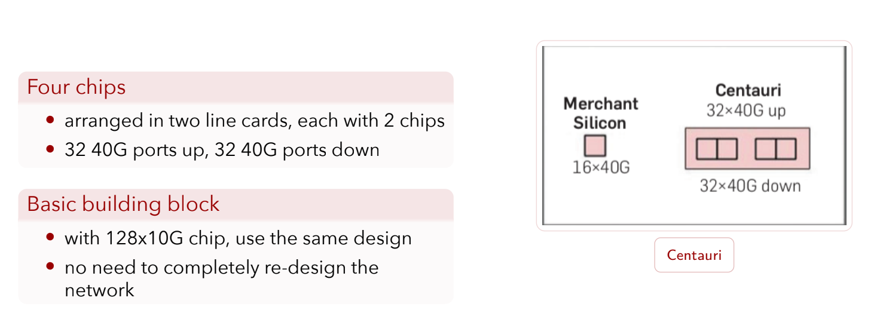
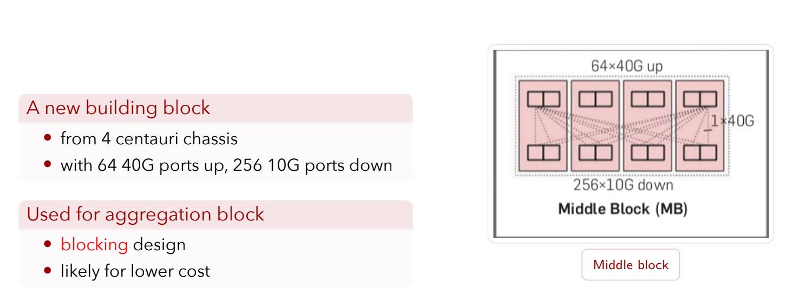
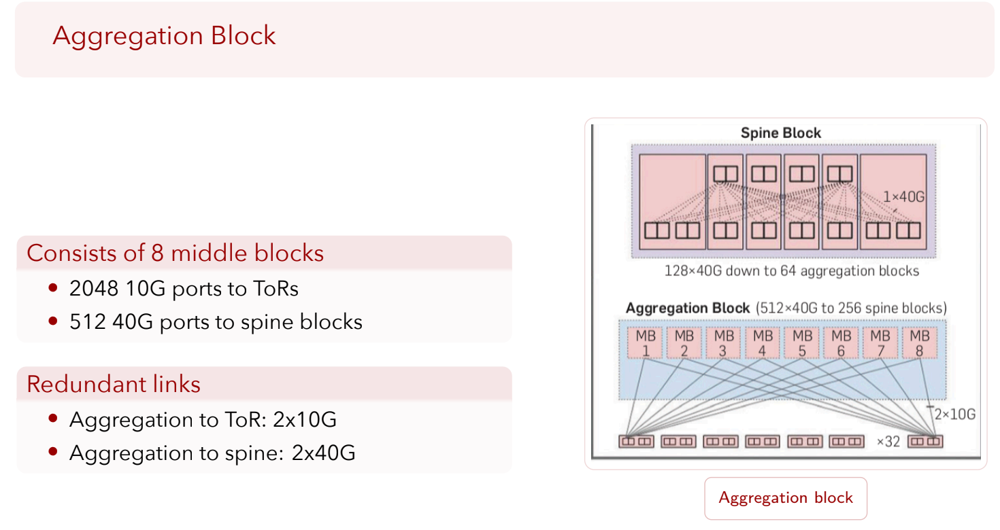
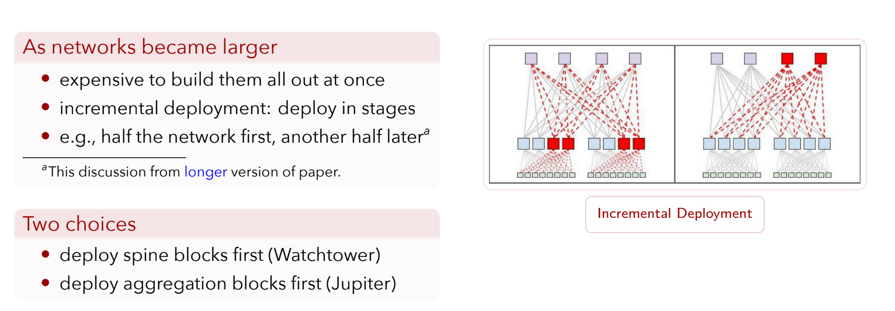
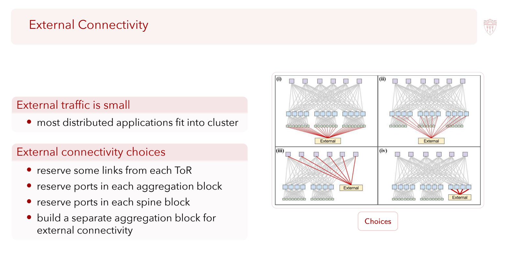

# Jupiter Rising

## the Blocks

把四个 32x40G 的 chip 放在一起，中间不连接，可以获得一个 Centauri.

利用这个 Centauri 可以建造 Middle Block 和 Spine Block 等。

这个就是把四个并列放，然后进行连接。

这个也是同样，进行特定的排列，然后建造一个 Spine Block

## Incremental Deployment

左边是 spine-first,

右边是 aggregation-first

在这种设计中，只能 double double 去建造。

## External Connection

这里就是几种连接到外面的方法，这里展示了四种方法。

当然，Google有Google自己的做法，后面会展示。当然，读论文的时候也提前看了。

External traffic 是 **相对** 连稀疏的！

> [!tip]
> 这个很好理解。如果你查看一个网页，其实有很多元素组成。比如产品图片，产品价格，评论，这些东西都要组合起来，这些其实都是需要internal来解决的。整合之后，才发到外面去。所以其实内部的网络traffic肯定是更拥挤的。