# Data Center Papers

- [Data Center Papers](#data-center-papers)
  - [Jupiter Rising](#jupiter-rising)
    - [Abstract](#abstract)
    - [Intro](#intro)
    - [Related Work](#related-work)
    - [Network Evolution](#network-evolution)
      - [the table](#the-table)
      - [Firehose](#firehose)
      - [Watchtower and Saturn: Global deployment](#watchtower-and-saturn-global-deployment)
      - [Jupiter: A 40G datacenter-scale fabric](#jupiter-a-40g-datacenter-scale-fabric)
    - [EXTERNAL CONNECTIVITY](#external-connectivity)
      - [4.1. WCC: Decommissioning legacy routers](#41-wcc-decommissioning-legacy-routers)
      - [4.2. Inter-cluster networking](#42-inter-cluster-networking)
    - [SOFTWARE CONTROL](#software-control)
      - [5.1. Discussion](#51-discussion)
      - [5.2. Routing](#52-routing)
      - [5.3. Configuration and management](#53-configuration-and-management)
    - [EXPERIENCE](#experience)


## Jupiter Rising

### Abstract

We present our approach for overcoming the cost, operational complexity, and limited scale endemic to datacenter networks a decade ago. Three themes unify the five generations of datacenter networks detailed in this paper. First, multi-stage Clos topologies built from commodity switch silicon can support cost-effective deployment of building scale networks. Second, much of the general, but complex, decentralized network routing and management protocols supporting arbitrary deployment scenarios were overkill for single-operator, pre-planned datacenter networks. We built a centralized control mechanism based on a global configuration pushed to all datacenter switches. Third, modular hardware design coupled with simple, robust software allowed our design to also support inter-cluster and wide-area networks. Our datacenter networks run at dozens of sites across the planet, scaling in capacity by 100x over 10 years to more than 1 Pbps of bisection bandwidth. A more detailed version of this paper is available at Ref.21

我们展示了克服十年前数据中心网络固有的成本高昂、运营复杂及规模受限问题的方法。本文详细介绍的五代数据中心网络由三个主题统一贯穿：
- 第一，由**商用交换芯片（commodity switch silicon）** 构建的多级 Clos 拓扑结构，能够支持楼宇级规模网络的成本效益部署。
- 第二，许多支持任意部署场景、通用但复杂的去中心化网络路由和管理协议，对于单一运营商且预先规划好的数据中心网络来说显得大材小用。我们构建了一种基于全局配置推送至所有数据中心交换机的集中式控制机制。
- 第三，模块化硬件设计结合简单、稳健的软件，使我们的设计还能支持集群间网络和广域网。

我们的数据中心网络运行在全球数十个站点，容量在 10 年间增长了 100 倍，其二分带宽（bisection bandwidth）已超过 1 Pbps。

### Intro

From the beginning, Google built and ran an internal cloud for all of our internal infrastructure services and external facing applications. This shared infrastructure allowed us to run services more efficiently through statistical multiplexing of the underlying hardware, reduced operational overhead by allowing best practices and management automation to apply uniformly, and increased overall velocity in delivering new features, code libraries, and performance enhancements to the fleet.

从一开始，谷歌就构建并运行了一个内部云平台，用于支持我们所有的内部基础设施服务和面向外部的应用程序。这种共享基础设施使我们能够通过底层硬件的统计复用更高效地运行服务，通过统一应用最佳实践和管理自动化来降低运营开销，并提高向整个系统交付新功能、代码库和性能改进的整体速度。

We architect all these cloud services and applications as large-scale distributed systems. 3, 6, 7, 10, 13 The inherent distributed nature of our services stems from the need to scale out and keep pace with an ever-growing global user population. Our services have substantial bandwidth and low-latency requirements, making the datacenter network a key piece of our infrastructure. Ten years ago, we found the cost and operational complexity associated with traditional datacenter network architectures to be prohibitive. Maximum network scale was limited by the cost and capacity of the highest-end switches available at any point in time. 23 Bandwidth demands in the datacenter have been doubling every 12–15 months (Figure 1), even faster than the wide area Internet. Essentially, we could not buy a network at any price that could meet our scale and performance needs.

我们将所有这些云服务和应用程序都设计为大规模分布式系统。3、6、7、10、13 我们服务的分布式特性源于需要扩展规模并跟上不断增长的全球用户群体。我们的服务对带宽和低延迟有着极高的要求，因此数据中心网络成为我们基础设施的关键组成部分。十年前，我们发现传统数据中心网络架构的成本和运营复杂性令人望而却步。网络的最大规模受到当时可用的最高端交换机的成本和容量的限制。23 数据中心的带宽需求每 12-15 个月就会翻一番（图 1），甚至比广域互联网的增长速度还要快。实际上，我们当时无论花多少钱都无法购买到能够满足我们规模和性能需求的网络。

More recently, Google has been expanding aggressively in the public Cloud market, making our internal hardware and software infrastructure available to external customers. This shift has further validated our approach to building scalable, efficient, and highly available data center networks. With our internal cloud deployments, we could vertically integrate and centrally plan to co-optimize application and network behavior. A bottleneck in network performance could be alleviated by redesigning Google application behavior. If a single site did not provide requisite levels of availability, the application could be replicated to multiple sites. Finally, bandwidth requirements could be precisely measured and projected to inform future capacity requirements. With the external cloud, application bandwidth demands are highly bursty and much more difficult to adjust. For example, an external customer may in turn be running third party software that is difficult to modify. We have found that our data center network architecture substantially eases the management overhead of hosting external applications while simultaneously delivering new levels of performance and scale for Cloud customers.

近年来，谷歌一直在积极拓展公共云市场，将我们的内部硬件和软件基础设施开放给外部客户。这一转变进一步验证了我们构建可扩展、高效且高可用数据中心网络的方法。通过内部云部署，我们可以进行垂直整合和集中规划，从而协同优化应用程序和网络性能。网络性能瓶颈可以通过重新设计谷歌应用程序的行为来缓解。如果单个站点无法提供所需的可用性水平，则可以将应用程序复制到多个站点。此外，我们可以精确测量和预测带宽需求，从而为未来的容量规划提供依据。而在外部云环境中，应用程序的带宽需求波动性很大，也更难以调整。例如，外部客户可能运行的是难以修改的第三方软件。我们发现，我们的数据中心网络架构显著降低了托管外部应用程序的管理开销，同时为云客户提供了更高水平的性能和可扩展性。

Inspired by the community’s ability to scale out computing with parallel arrays of commodity servers, we sought a similar approach for networking. This paper describes our experience with building five generations of custom data center network hardware and software by leveraging commodity hardware components, while addressing the control and management requirements introduced by our approach. We used the following principles in constructing our networks:

受社区利用并行服务器阵列扩展计算能力的启发，我们尝试在网络领域采用类似的方法。本文描述了我们利用商用硬件组件构建五代定制数据中心网络硬件和软件的经验，并探讨了这种方法带来的控制和管理方面的挑战。我们在构建网络时遵循以下原则：

**Clos topologies:** To support graceful fault tolerance increase the scale/bisection of our datacenter networks, and accommodate lower radix switches, we adopted Clos topologies1, 9, 15 for our datacenters. Clos topologies can scale to nearly arbitrary size by adding stages to the topology, principally limited by failure domain considerations and control plane scalability. They also have substantial in-built path diversity and redundancy, so the failure of any individual element can result in relatively small capacity reduction.
However, they introduce substantial challenges as well,
including managing the fiber fanout and more complex routing across multiple equal-cost paths.

**Clos 拓扑结构：** 为了支持优雅的容错机制、扩展数据中心网络的规模/双向带宽，并适应低端口数交换机，我们在数据中心采用了 Clos 拓扑结构1、9、15。Clos 拓扑结构可以通过增加拓扑层级扩展到几乎任意规模，其主要限制因素是故障域的考虑和控制平面可扩展性。它们还具有显著的内置路径多样性和冗余性，因此任何单个组件的故障只会导致相对较小的容量损失。
然而，它们也带来了一些重大挑战，包括光纤扇出管理以及跨多个等成本路径的更复杂的路由。

**Centralized control protocols:** Control and management
become substantially more complex with Clos topologies
because we dramatically increase the number of discrete
switching elements. Existing routing and management pro-
tocols were not well-suited to such an environment. To con-
trol this complexity, we observed that individual datacenter
switches played a pre-determined forwarding role based on
the cluster plan. We took this observation to one extreme by
collecting and distributing dynamically changing link state
information from a central, dynamically elected, node in the
network. Individual switches could then calculate forward-
ing tables based on current link state relative to a statically
configured topology.

**集中控制协议：** 由于 Clos 拓扑结构显著增加了独立交换元件的数量，控制和管理变得异常复杂。现有的路由和管理协议并不适用于这种环境。为了控制这种复杂性，我们发现每个数据中心交换机都根据集群规划扮演着预先确定的转发角色。我们进一步利用这一发现，从网络中一个动态选举的中心节点收集并分发动态变化的链路状态信息。然后，各个交换机可以根据当前链路状态和静态配置的拓扑结构计算转发表。

Overall, our software architecture more closely resembles
control in large-scale storage and compute platforms than
traditional networking protocols. Network protocols typi-
cally use soft state based on pair-wise message exchange,
emphasizing local autonomy. We were able to use the dis-
tinguishing characteristics and needs of our datacenter
deployments to simplify control and management proto-
cols, anticipating many of the tenets of modern Software
Defined Networking (SDN) deployments. 12 The datacenter
networks described in this paper represent some of the larg-
est in the world, are in deployment at dozens of sites across
the planet, and support thousands of internal and external
services, including external use through Google Cloud
Platform. Our cluster network architecture found substantial
reuse for inter-cluster networking in the same campus and
even WAN deployments17 at Google.

总体而言，我们的软件架构与大型存储和计算平台中的控制方式更为相似，而非传统的网络协议。网络协议通常基于点对点消息交换使用软状态，强调本地自治。我们利用数据中心部署的独特特性和需求，简化了控制和管理协议，这与现代软件定义网络 (SDN) 部署的许多原则不谋而合。12 本文描述的数据中心网络是世界上最大的网络之一，已在全球数十个站点部署，并支持数千项内部和外部服务，包括通过 Google Cloud Platform 提供的外部服务。我们的集群网络架构在同一园区内的集群间网络连接，甚至在 Google 的广域网部署中都得到了广泛应用。17

***

这篇文章的**引言（Introduction）** 部分主要交代了 Google 为什么要自主研发数据中心网络，以及他们遵循的核心设计理念。
以下是引言部分的详细内容拆解：

**1. 共享基础架构的背景**
Google 从一开始就为其所有的内部服务和外部应用构建并运行了一个内部云（Internal Cloud）。这种共享的基础架构带来了三大好处：
- 效率提升： 通过底层硬件的统计复用（Statistical Multiplexing），让资源利用更高效。
- 降低运营成本： 能够统一应用最佳实践和自动化管理。
- 增加交付速度： 加快了新功能、代码库和性能增强在整个集群中的部署速度。

**2. 传统网络的局限性与“买不到”的困境**
Google 的服务本质上是大规模分布式系统，对带宽和低延迟有极高的要求。然而在十年前，Google 发现传统的网络架构存在严重问题：
- 成本与复杂性： 传统架构的成本高得令人生畏，且运营复杂。
- 规模受限： 网络的最高规格受限于当时市场上最顶尖交换机的容量。
- 带宽增长过快： Google 内部数据中心的带宽需求每 12-15 个月就翻一倍（见图1），增长速度甚至超过了广域网（Internet）。
- 结论： Google 发现，当时在市场上无论花多少钱，都买不到能满足其规模和性能需求的网络设备。

> [!TIP]
> Google 内部机器之间的通信量，远比用户从外部访问 Google 的流量增长得更快。


**3. 向公有云扩展的挑战**

随着 Google Cloud 业务的扩张，网络架构面临新的考验。在内部云中，Google 可以对应用和网络进行协同优化（例如，如果网络有瓶颈，可以重写应用代码）；但对于外部云客户，流量往往更加**突发（Bursty）** 且难以调整。幸好，Google 自研的网络架构大大减轻了托管这些外部应用的运营开销。

**4. 解决问题的三个核心原则**

受大规模并行服务器集群的启发，Google 决定用“横向扩展（Scale-out）”的思路来构建网络，并遵循以下三个原则：
- Clos 拓扑结构： 为了实现容错和大规模的二分带宽（Bisection Bandwidth），Google 采用了 Clos 拓扑。这种拓扑通过增加级数可以无限扩展规模，并具有天然的路径多样性和冗余，单个元件损坏对容量影响很小。
- 商用交换芯片（Merchant Silicon）： 放弃功能复杂、价格昂贵的传统商业交换机，转向使用通用的、价格低廉的商用芯片。通过频繁的更替（跟随摩尔定律）来维持带宽密度的快速增长。
- 集中式控制协议： 传统的去中心化协议（如 OSPF/BGP）在处理拥有成千上万个元件的 Clos 架构时过于复杂。Google 意识到数据中心内部拓扑是预先规划好的，因此采用了一个集中式的 Master 节点来收集链路状态并向所有交换机推送转发指令。

**5. 软件定义网络（SDN）的先驱**
Google 的这种软件架构与其说像传统的网络协议，不如说更像大规模存储或计算平台的控制系统。这种设计预见并应用了现代**软件定义网络（SDN）** 的许多核心准则。

总结： 引言部分明确了核心矛盾——爆炸式的带宽需求 vs. 昂贵且受限的传统商业方案，并由此引出了 Google 坚持的硬件模块化、芯片通用化和控制集中化的演进路径。

**Clos拓扑结构了是啥意思**

它的物理结构：三层金字塔（参考图 2）
Google 的 Clos 架构通常分为三层（也叫三级，3-stage），你可以把它想象成一个网状连接的层级系统：
- 底层：Edge Switches (边缘交换机/ToR)
  - 位于服务器机柜的最上方（Top of Rack）。
  - 向下：直接连着几十台服务器。
  - 向上：连到中间的聚合块。
- 中层：Aggregation Blocks (聚合块)
  - 起到“中转枢纽”的作用。
  - 它不直接连服务器，而是把底层所有的 Edge 交换机连起来，并向上连到顶层的骨干块。
- 顶层：Spine Blocks (骨干块)
  - 这是整个数据中心的“大动脉”。
  - 所有的聚合块都会连到所有的 Spine 块上。这样，数据中心里任何两台服务器之间通信，都可以通过这些“大动脉”完成。

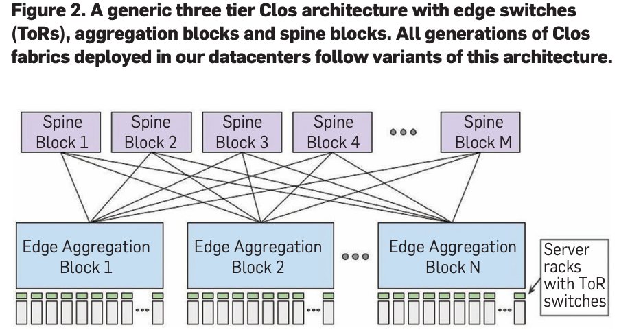

**它的代价是什么？（麻烦的地方）**
Clos 并不是完美的，它的挑战在于：
- 布线灾难（Fiber Fanout）： 因为所有的交换机都要互联，电缆数量会多到头皮发麻。来源中提到，早期的 Firehose 1.1 曾因为布线太复杂而遭遇巨大的部署挑战。
- 路由复杂： 流量可以在成千上万条等价的路径中选择（ECMP），这导致传统的路由协议（如 OSPF）根本带不动，所以 Google 才自研了集中式控制的 Firepath 协议。
一句话总结： Clos 拓扑就是 **“团结力量大”**——通过科学的排列组合，用成千上万个便宜的小盒子，搭出了一个支撑全球流量的超级数据中心网络。

> **为什么要这么多层呢。
首先是服务器，向上走跑到一台交换机（边缘交换机里）然后边缘交换机再到聚合块，然后聚合块再到骨干块，为什么需要这么多层，为什么需要这三层呢？** \
> 因为 Google 一直使用到是廉价的，端口数很少的交换机，肯定不能连很多机器啊。

**集中式控制协议（Centralized control protocols）是什么？**

传统协议（OSPF/BGP）带不动。是因为在传统的去中心化模式下每个交换机通过 OSPF 和 BGP 协议与邻居不停的交换信息（就像成千上万个人在嘈杂的房间里互相通话），最终拼凑出全网的地图。

这些通信很占用带宽。

Google 认为：既然数据中心是我盖的，网线是我埋的，所有交换机的位置和角色其实早就在我的全局配置里定好了。于是他们自研了名为 Firepath 的控制系统。

- 静态地图（Static Map）： 每一台交换机在启动时，都会加载一份全网的静态拓扑配置（Cluster Config）。它知道自己在这个巨大的“三层金字塔”中处于什么位置，也知道它的邻居原本应该是谁。
- 集中式 Master： Google 在网络中动态选出一个“司令官”（Master）。
- 动态汇报： 每个交换机（Client）只需要盯着自己连接的那几根网线，看看谁断了谁通着，然后把这个链路状态汇报给 Master。
- 全局分发： Master 把收集到的全网状态汇总成一个很小的数据库（LSD，不到 64KB），然后像广播电台一样，把这个最新状态推送给所有的交换机。
- 本地计算： 每个交换机拿到 Master 发来的最新“路况信息”后，结合自己手里的“静态地图”，自己计算出该往哪跑。


**总结来说：** 传统协议像是在黑盒子里通过邻居摸索路线；而 Google 的集中式控制则是给每个人发一张完整的地图，并由一个“塔台”实时播报路况，让大家各自更新自己的路线图。

### Related Work

根据来源文件，这篇文章的“背景与相关工作”（Background and Related Work）部分主要解释了 Google 为什么要放弃传统网络架构，以及他们的自研之路与当时学术界、工业界研究的联系。

以下是该部分的要点总结：

**1. 动力来源：爆炸式的需求增长**
Google 基础架构的增长速度是其自研网络的核心动力。
- 流量激增： 自 2008 年以来，Google 数据中心内部的总通信流量增加了 **50 倍**，大约每年翻一倍。
- 驱动因素： 这种需求主要来自远程存储访问、大规模数据处理（如 MapReduce）以及交互式 Web 服务（如搜索和广告）。随着 Google Cloud Platform (GCP) 的普及，这种增长进一步加速。

**2. 2004 年的传统架构及其局限**
在 2004 年左右，Google 使用的是传统的集群网络：
**规格：** 每个机柜 40 台服务器，通过 1 Gbps 链路连接到机顶交换机（ToR），上行带宽存在 **10:1 的超分比**（即总带宽远小于服务器需求）。
**痛点：** 
- 应用受限：高带宽应用必须挤在同一个 ToR 下，否则会遭遇严重的带宽瓶颈。
- 调度效率低：小集群限制了任务调度的“装箱”（bin-packing）效率。如果一个大作业无法塞进单个小集群，即便全网有剩余空间也无法运行。
- 性能差、成本高：低带宽导致丢包严重（如 incast 丢包问题），而提升带宽的成本在当时极其昂贵。

**3. Google 的决策：走自研之路**
Google 意识到当时的商业方案无法同时满足规模、管理和成本的要求，因此决定利用以下技术自研硬件和软件：
- Clos 拓扑与商用芯片：Google 发现可以利用当时新兴的商用交换芯片（Merchant Silicon），通过 Clos 拓扑结构构建出几乎可以无限扩展的织网。

**4. 与当代相关研究的对比**
Google 承认他们的技术路径与当时的学术研究有许多相似之处：
- 拓扑结构：他们采用的 Clos 拓扑、依赖商用芯片以及多路径负载均衡（ECMP）的方法，与同时期的学术研究（如 Al-Fares 等人的 Fat-Tree 和 微软的 VL2）在本质上是相似的。
- 软件定义网络 (SDN)：他们在交换机嵌入式处理器上运行的集中式控制协议，与后来兴起的 SDN 理念高度一致。
- 技术延伸： Google 后来将这种在数据中心内验证过的 SDN 理念应用到了其广域网（WAN）项目 B4 中。

### Network Evolution

#### the table

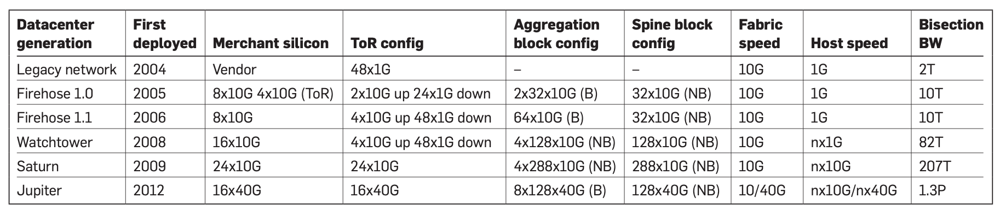

**Merchant Silicon (商用芯片)**

这不是某颗芯片的名字，而是一个行业术语，指代市面上可以买通用的、廉价的商用交换芯片（如 Broadcom 或 Mellanox 的芯片），而不是厂家为特定设备定制的昂贵芯片。

几G x 几G (例如 8x10G)： 这代表单颗芯片的交换能力。第一个数字是端口数量，第二个数字是每个端口的速率。
- 8x10G：表示这颗芯片有 8 个端口，每个端口支持 10 Gbps 的带宽。
- 16x40G（Jupiter 时代）：表示单颗芯片有 16 个端口，每个支持 40 Gbps。

**ToR Config (机顶交换机配置) 中的 Up 和 Down**

ToR 交换机像是一个“中转站”，一边连着服务器，一边连着上层网络。
• Down (向下)： 指连接到**服务器（Hosts）**的端口。例如 FH1.1 是 48x1G down，意味着一台 ToR 连着 40-48 台 1G 网卡的服务器。
• Up (向上)： 指连接到上层**织网（Fabric/Aggregation Block）**的端口。这决定了整个机柜能向外发送多少流量。

**Aggregation Block Config (聚合块配置)**
“块（Block）”是由多台交换机组成的逻辑单元。
- 数字含义（例如 FH1.1 的 64x10G）： 这描述了该聚合块向外（向 Spine 层）提供的总物理端口数量。
- 括号里的 (B) 或 (NB)：
    - (B) 代表 Blocking（有阻塞）： 意味着内部流量太猛时，出口带宽不够用，会发生拥塞。
    - (NB) 代表 Nonblocking（无阻塞）： 意味着该模块的设计能保证所有下层流量都能全速通过，不会在内部塞车。

> [!tip]
> 这个概念上课的时候又重新提了。\
> 比如，这个结构：
> 有三层，从左到右。左边第一层有两个入口，中间有四个，右边有两个出口。这个就是NB。就算左边还是右边，塞满，中间因为连接多。这样就是NB的。\
> 如果是两层，从左到右，分别都是2。然后全连接。这样就是会B的。\
> 这个也很好理解。很明显，NB设计要贵很多

**Spine Block Config (骨干块配置)**
这是 Clos 架构的最顶层（Stage 3）。
• 数字含义（例如 Watchtower 的 128x10G）： 指这个骨干块拥有 128 个 10G 端口，用来把下面所有的“聚合块”连接在一起。

**其他关键参数**
- Fabric Speed (织网速度)： 指交换机之间互相连接的网线速度。从表上看，前四代都是 10G 互连，到了 Jupiter 时代跨越到了 40G。
- Host Speed (主机速度)： 服务器网卡的最高速度。
  - 1G/10G：单根线的速度。
  - nx1G / nx10G：表示服务器可能插了多块网卡或者使用了多通道技术（n 倍速度）。
- Bisection BW (二分带宽)： 这是衡量网络总容量的最硬指标。它指的是把整个网络对半切开，中间连线的总带宽。
  - 你可以看到它从 2004 年的 2T (Terabits) 增长到了 2012 年的 1.3P (Petabits)，整整翻了 650 倍。

#### Firehose

> 我理解一下，首先，server互相通信快，必须在同一个ToR下，如果要不是同一个ToR，就会变得很慢（十分之一）。然后，10000个server是不可能同时弄到同一个tor下的，所以要设计新的方法，对吗\
> 对的！

**目标：10K 服务器的大规模连接**

Google 最初的目标非常明确：为10,000 台服务器提供1Gbps 的无阻塞二分带宽。
- 背景：当时（2005年前后）商业设备无法以低成本支持这种规模。
- FH1.0 架构：采用了 **8x10G** 的商用芯片。其机顶交换机（ToR）有 24 个 1G 端口连接服务器，2 个 10G 端口连入织网（Fabric）。

**Firehose 1.0：一次“惨痛”的创新尝试**

这一段描述了 Google 走过的一个弯路：把交换机塞进服务器里。

**设计思路：** 因为 Google 当时只会造服务器，不会造交换机，所以他们异想天开地把交换芯片做成了PCI 插卡，直接插在普通的服务器主板上。

**失败的原因：**
- 稳定性差： 服务器的操作系统经常崩溃或需要升级。
- 重启太慢： 交换机（ToR）如果因为服务器重启而断网，那它后面连着的几十台服务器就全断了。
- 硬件噩梦： 这种设计导致了极其恐怖的布线复杂度和电气可靠性问题。
- 结局： FH1.0 从未承载过实际的生产流量。但 Google 认为它是一个“里程碑”，因为没有这次失败，就没有后面的成功。

> 这样子的话，交换机就不是一台机子了，如果server挂机了，交换机也直接下线了。所以不好，对吗？对的。\
> 现在的好的设计，交换机其实是一台独立的，机器，是不会因为server挂机而关机的，对吗？对的。

**Firehose 1.1：第一代实战架构**

吸取教训后，Google 在 2006 年推出了 **FH1.1**，这是他们第一个真正投入使用的自研网络。

- 硬件重构： 放弃了服务器插卡模式，改用专门的定制机箱（Custom enclosures）。这些机箱包含 6 个独立的线路卡（Linecards）和一个专用的单板计算机（SBC）来控制它们。
- 物理连接： 这一代机箱没有背板（Backplane）。所有的交换芯片端口都直接通过外部铜缆连接。这就是你之前看到的“布线噩梦”，但也最容易快速制造。

灰度部署与“大红按钮” (Big Red Button)

由于自研技术在当时还没经过验证，Google 采取了极其谨慎的部署策略：

- 旁路部署 (Bag-on-the-side)： 如图 5 所示，Google 将 FH1.1 网络挂在原有的传统（Legacy）网络旁边，两者并存。
- 流量分配：
  - 对内：集群内部服务器之间的流量走 FH1.1（因为带宽大）。
  - 对外：出集群的流量走传统老网络。
  - 安全防范：他们设计了一个“大红按钮” (Big Red Button)。这是一种安全机制，一旦自研的 Firehose 出了大故障，管理员可以一键命令所有 ToR 交换机断开 Firehose 的连接，把所有流量切回稳健的老网络。

**软件与管理：Firepath 的诞生**

为了管理这些成千上万的端口，Google 同时也开发了配套的软件控制系统：
-  Firepath 协议：这就是我们之前聊到的集中式控制协议。它让交换机加载“静态地图（Cluster Config）”，并由中央 Master 节点广播链路状态变化。
- 服务器化管理：Google 把交换机当成普通服务器来管，复用了镜像安装、监控和告警系统。

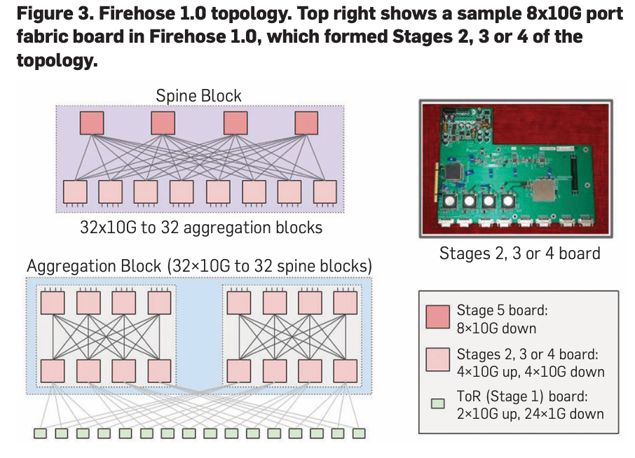

**对于这个图片，我提出的疑问：Firehose1.0为啥有这么多层，不是说1.0把交换机芯片集成到server上，然后直接连接到织网里面吗？**

核心矛盾：小芯片 vs 大规模
- 硬件限制：当时用的商用芯片只有 8 个端口 (8x10G)。
- 目标规模：要连接 10,000 台服务器。
- 物理现实：单颗芯片接口太少，不可能让 10,000 台机器直接互联。

为什么要分 5 层 (Stages)？
- Clos 拓扑原理：要用“小口”芯片组建“大”网络，必须通过增加层级 (Stages) 来横向扩展规模。
- 各层分工：
  - Stage 1 (ToR)：集成在服务器里，负责把服务器接入网络。
  - Stage 2-4：中间层，负责流量的汇聚与分发。
  - Stage 5：最高层（Spine），负责连接整个数据中心的所有块。

> [!tip]
> 所以这个拓扑结构，不是 Jupiter 时代才有的，而是 Firehose 时代就有了！\
> 其实也很好理解，当时的交换芯片只8个端口，只能连8个机子，而我需要10000个，那肯定要拓扑一下啊。


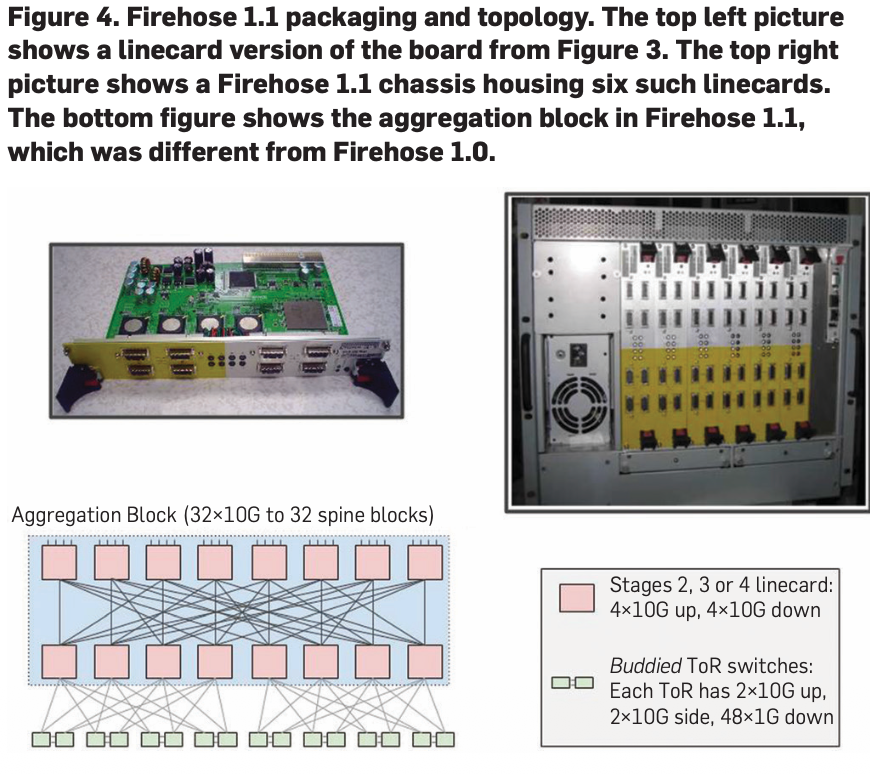

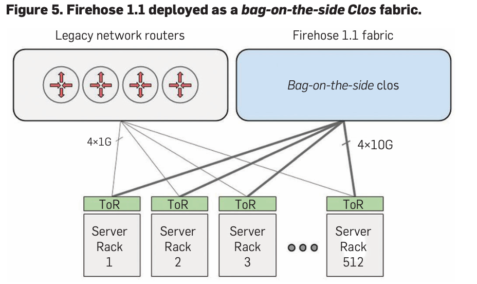

图5就是部署的这个大红按钮。

#### Watchtower and Saturn: Global deployment

这一部分标志着 Google 自研网络从“实验期”正式进入“全球大规模部署期”。**Watchtower (2008)** 和 **Saturn (2009)** 解决了之前 Firehose 遗留的物理难题，并让带宽翻了数倍。

**Watchtower (第三代，2008)：物理架构的成熟**
- 硬件大升级：采用了 16x10G 的商用芯片。
- 回归传统机箱：不同于 Firehose 1.1 那种满身线缆的盒子，Watchtower 采用了带有背板（Backplane）的传统交换机机箱。
- 优点：芯片间的连接在机箱内部通过背板完成，不再需要密密麻麻的外部铜缆，部署难度大幅降低。
- 光纤时代：开始使用SFP+ 光纤代替铜缆，解决了 1.1 时代的“布线噩梦”。
- 规模：一个 Watchtower 机箱拥有128 个 10G 端口，支持更大的织网带宽。

**Saturn (第四代，2009)：追求极致性能**
- 更强的芯片：使用 24x10G 商用芯片。
- 超大容量：单机箱支持 288 个端口（非阻塞交换）。
- Pluto 机顶交换机：
  - 引入了专门的 **Pluto（单芯片 ToR）**。
  - 首次爆发：服务器第一次可以在织网中实现 10 Gbps 的全速爆发带宽（Burst）。
  - 平均带宽也从原来的 100Mbps 进化到了2-5 Gbps。

**全球部署与“干掉”传统路由器 (WCC)**
- 信心大增：由于 Firehose 1.1 的实战表现非常省钱且高带宽，Google 开始在全球范围内部署这两代架构。
- WCC 项目*：随着 Watchtower 的稳定，Google 开始执行 WCC (Watchtower Cluster Choice) 计划——拆除昂贵的商业路由器（Legacy Routers）。
- 不再把自研网挂在老网旁边（旁路部署），而是让自研织网通过 CBR (集群边界路由器) 直接管理所有流量。
- 规模化生产：为了快速在全球建设集群，Google 简化了配置，只提供几种标准的“菜单”供运维人员选择，实现了像造服务器一样造网络。

| 特征 | Watchtower (图 6) | Saturn (图 7) |
| :--- | :--- | :--- |
| **芯片** | 16x10G 芯片 | 24x10G 芯片 |
| **机箱连接** | **有背板** (物理连接简单) | 无背板/全前面板口 |
| **线缆** | **光纤 (SFP+)** | 光纤 |
| **服务器速度** | 1G 基础带宽 | **10G 爆发带宽** |
| **部署意义** | 解决了布线难题，开始取代老设备 | 实现了更大规模和更高的突发性能 |

**一句话理解：** Watchtower 把网络变“整洁”了（背板+光纤），Saturn 把网络变“极速”了（10G Burst），这两代产品让 Google 有信心彻底拆掉买来的昂贵商业设备，全面转为自研。

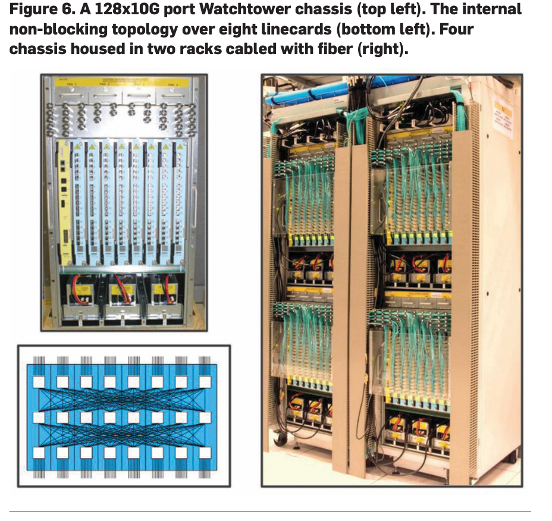

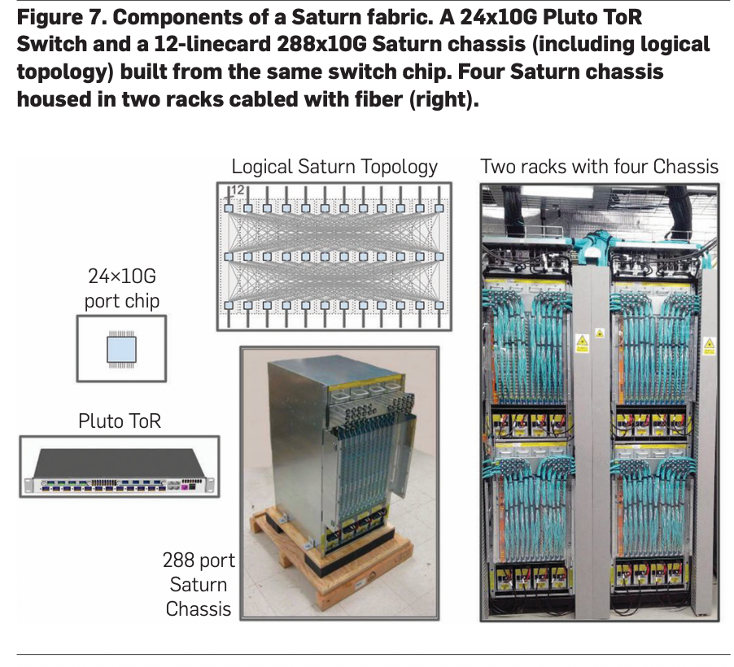

#### Jupiter: A 40G datacenter-scale fabric

Jupiter (第五代，2012)：40G 数据中心级织网

Jupiter 标志着 Google 进入了**40G 时代**，它的目标是把整个“数据中心”连成一个巨大的网络，而不仅仅是单个集群。

**核心目标：超大规模与统一性**
- 规模爆炸：规模比之前最大的网络还大 6 倍，提供 1.3 Pbps（1300 Tbps）的二分带宽。
- 全网互通：不再区分“集群内”和“集群间”网络，整个数据中心就是一个统一的巨大织网（Fabric）。
- 位置无关：因为带宽极大且统一，应用部署在数据中心任何位置都一样，极大方便了调度。

**关键硬件：Centauri 机箱**
- 通用积木：Jupiter 的基本单元是 Centauri 机箱（4RU 高度）。
- 芯片配置：内含 4 颗交换芯片，每颗芯片支持 16x40G 端口。
- 物理特点：机箱内部没有背板，所有端口都在前面板上，通过光纤灵活连接。

**革命性突破：增量升级（Incremental Deployment）**
- 混合部署：这是第一代支持不同硬件、不同速度混跑的架构。
- 不停机升级：不需要像以前那样“推倒重来”（Forklift upgrade），可以在不影响生产流量的情况下，在原位（in situ）逐步替换旧设备。

**逻辑结构 (拓扑层级)**
- ToR (机顶交换机)：使用 Centauri 机箱，服务器首次实现了40G 的突发带宽。
- Middle Block (MB, 中间块)：由 4 台 Centauri 组成，用于聚合层。
- Spine Block (骨干块)：由 6 台 Centauri 组成，每组暴露 128 个 40G 端口连向全网。

| 特征 | Jupiter 关键点 |
| :--- | :--- |
| **速度** | **40G** 时代，总带宽 **1.3 Pbps** |
| **核心积木** | **Centauri 机箱**（16x40G 芯片） |
| **最大特点** | **支持异构**（新旧设备混用），支持**增量升级** |
| **部署范围** | **整个数据中心**（Subsuming inter-cluster layer） |

**一句话理解：** Jupiter 是一个由 40G 芯片堆出来的“怪兽”，它把整个数据中心变成了一个巨大的、可以随时局部升级的虚拟交换机。

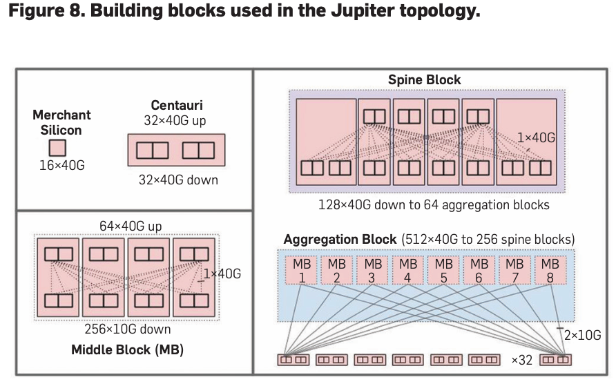

### EXTERNAL CONNECTIVITY

#### 4.1. WCC: Decommissioning legacy routers

**WCC 项目：干掉昂贵的商业路由器**
- 目标：由于自研网络已经稳定，Google 决定拆除之前依赖的第三方昂贵路由器。
- 手段：引入 Cluster Border Routers (CBRs，集群边界路由器)。
- 做法：其实就是把普通的 Watchtower 或 Saturn 交换机拿出来，不连服务器，而是专门用来连外部网络。这样可以隔离风险，即便外部配置改错了，也不会波及整个集群内部。

**Freedome：自研的“互联织网”**
- 背景：之前集群之间、建筑之间的连接还在用昂贵的商业设备，性能差且贵。
- 方案：Google 模仿集群内部的 Clos 结构，造了一个更大的两级结构，叫 Freedome。
- 层级：
  - Datacenter Freedome：连接同一栋楼里的多个集群。
  - Campus Freedome：连接同一个园区里的多栋楼。
  - 最终阶段：这种设计后来被直接应用到了 Google 的广域网（WAN）部署中。

**协议切换：Firepath 与 BGP 的交接**
- 内部：集群内部跑的是 Google 自家的 Firepath 协议（速度快、简单）。
- 外部：为了和全世界的设备通信，在 CBR（边界路由器）上必须运行标准的 BGP 协议,。
- 翻译官：Google 在 CBR 上做了一个“代理进程”，负责把内部的路由信息翻译成 BGP 告诉外面，同时也把外面的信息带回内部。


4.1. WCC: Decommissioning legacy routers

Through the first few Watchtower deployments, all cluster
fabrics were deployed as bag-on-the-side networks coexist-
ing with legacy networks (Figure 5). Time and experience
ameliorated safety concerns, tipping the balance in favor of
reducing the operational complexity, cost, and performance
limitations of deploying two parallel networks.
Hence, our next goal was to decommission our legacy
routers by connecting the fabric directly to the inter-cluster
networking layer with Cluster Border Routers (CBRs). This
effort was internally called WCC.

4.1.WCC：退役遗留路由器

通过前几次守望台部署，所有集群结构都部署为与遗留网络共存的侧袋网络（图5）。时间和经验改善了安全问题，使天平倾斜，有利于降低部署两个并行网络的运营复杂性、成本和性能限制。因此，我们的下一个目标是通过使用集群边界路由器（CBR）将结构直接连接到集群间网络层来退役我们的遗留路由器。这一努力在内部被称为WCC。

To deliver high external bandwidth, we chose to build
separate aggregation blocks for external connectivity,
physically and topologically identical to those used for
ToR connectivity. However, we reallocated the ports nor-
mally employed for ToR connectivity to connect to exter-
nal fabrics. This mode of connectivity enabled an isolated
layer of switches to peer with external routers, limiting the
blast radius from an external facing configuration change.
Moreover, it limited the places where we would have to
integrate our in-house IGP (Section 5.2) with external rout-
ing protocols.

为了提供高外部带宽，我们选择为外部连接构建单独的聚合块，在物理和拓扑上与用于ToR连接的聚合块相同。然而，我们重新分配了通常用于ToR连接的端口，以连接到外部结构。这种连接模式使隔离的交换机层能够与外部路由器对等，从而限制了外部配置更改的爆炸半径。此外，它限制了我们必须将内部IGP（第5.2节）与外部路由协议集成的地方。

这一段话的意思是：

**这段话的核心意思是：为了让集群能和外面（其他集群或互联网）高速通信，Google 专门拨出了一批“交换机组合”作为专职的“守门员”。**
1. Google 没有为外部连接专门设计新硬件，而是直接搬来了和连服务器（ToR）完全一样的**聚合块（Aggregation Block）**硬件。改动：原本这些机器上的插口是向下连服务器的，现在他们把这些插口翻转过来，全部用来连接外部织网（External Fabrics）。
2. 安全防范（限制“爆炸半径”）
   1. 隔离层：通过建立这层独立的交换机，把“对内”和“对外”的功能完全隔开。
   2. 防错：如果外部网络的配置改错了（比如由于连接广域网导致的配置失误），这个错误只会被挡在这一层，不会波及数据中心内部的服务器通信。这就是文中所说的“限制爆炸半径（Blast Radius）”。
3. 简化协议转换
   1. 协议对接：Google 内部跑的是自己研发的 IGP（Firepath）协议，而外部世界跑的是通用的 BGP 协议。
   2. 减少麻烦：把外部连接独立出来后，Google 只需要在这些特定的“守门员”机器上处理这两种协议的对接（翻译）工作，而不需要让数据中心里成千上万台交换机都去处理复杂的外部路由协议

**其实我翻译一下就是：这个CBR有点像防火墙，放在内部我们升级好的网络，和外部混乱的网络之间。然后CBR其实就是拿已有聚合块来弄，很省钱**


#### 4.2. Inter-cluster networking

这一部分主要讲解了 Google 如何通过 Freedome 架构，解决集群与集群之间（Inter-cluster）以及大楼与大楼之间（Campus）的互联问题。
以下是为你整理的笔记：

1. 背景：昂贵的“最后一公里”
- 现状：Google 在同一栋楼里有多个集群，一个园区（Campus）里有多个大楼。
- 痛点：虽然集群内部已经自研，但连接这些集群的外部网络层仍然依赖昂贵且端口受限的商业设备（Vendor gear）。
- 需求：任务调度系统需要让关联的服务尽量离得近（Locality），因此需要极高的跨集群带宽来支持这种灵活性。

2. 核心方案：Freedome 织网
为了彻底取代商业设备，Google 研发了 Freedome，这是其网络进化的第三步。它本质上是一个基于 BGP 协议的两级 Clos 织网。
- 基本单元：Freedome Block (FDB)：
  - 由一组配置了 BGP 协议的路由器组成，是构建更大织网的积木。
- 两级部署架构 (图 10)：
  - Datacenter Freedome (DFD)：连接同一栋大楼内的多个集群。流量路径为：源集群 CBR → DFD → 目标集群 CBR。
  - Campus Freedome (CFD)：更上一层，连接同一个园区内的多个 DFD，并最终通向广域网（WAN）。

3. 技术特点与意义
- 协议选择：不同于内网的 Firepath，Freedome 在集群间和园区层级使用标准的 BGP 协议进行通信。
- 可扩展性：这种结构可以递归扩展，后来被直接应用到了 Google 的广域网（WAN）部署中。
- 性能提升：CBR 块在 Watchtower 时代支持 2.56 Tbps 外部带宽，到 Saturn 时代提升至 5.76 Tbps，Freedome 进一步释放了这些带宽


We deploy multiple clusters within the same building and
multiple buildings on the same campus. Given the rela-
tionship between physical distance and network cost,
our job scheduling and resource allocation infrastructure
leverages campus-level and building-level locality to co-
locate loosely affiliated services as close to one another as
possible. Each CBR block developed for WCC supported
2.56 Tbps of external connectivity in Watchtower and
5.76 Tbps in Saturn. However, our external networking
layers were still based on expensive and port-constrained
vendor gear. Freedome, the third step in the evolution of
our network fabrics, involved replacing vendor-based inter
cluster switching.


我们在同一建筑内部署了多个集群，并在同一校园内部署了多个集群。鉴于物理距离和网络成本之间的关系，我们的工作调度和资源分配基础设施利用校园层面和建筑层面的地理位置，尽可能将松散的附属服务区放在彼此附近。为WCC开发的每个CBR块在Watchtower中支持2.56 Tbps的外部连接，在Saturn中支持5.76 Tbps的外部连接。然而，我们的外部网络层仍然基于昂贵且受港口限制的供应商设备。Freedome是我们网络结构演变的第三步，涉及取代基于供应商的集群间交换。


We employed the BGP capability we developed for our
CBRs to build two-stage fabrics that could speak BGP at both
the inter cluster and intra campus connectivity layers. See
Figure 10. The Freedome Block shown in the top figure is
the basic building block for Freedome and is a collection of
routers configured to speak BGP.


我们利用我们为CBR开发的BGP能力来构建两级结构，可以在集群间和校园内连接层中说出BGP。参见图10。上图所示的Freedome Block是Freedome的基本构建块，是配置为说BGP的路由器的集合。


A Datacenter Freedome typically comprises four inde-
pendent blocks to connect multiple clusters in the same
datacenter building. Inter-cluster traffic local to the same
building would travel from the source cluster’s CBR layer to the Datacenter Freedome and finally to the CBR layer of the
destination cluster. We connect the top stage router ports
of the Freedome Block to the campus connectivity layer
to the north. The bottom left figure in Figure 10 depicts a
Datacenter Freedome.
Recursively, a Campus Freedome also typically comprises
four independent Freedome Blocks to connect multiple
Data-center Freedomes in a campus on the south and the
WAN connectivity layer on the north-facing side. The bot-
tom right figure in Figure 10 depicts a Campus Freedome.
This same approach would later find application for our
WAN deployments.


数据中心 Freedome 通常由四个独立的模块组成，用于连接同一数据中心建筑内的多个集群。同一建筑内的集群间流量将从源集群的 CBR 层传输到数据中心 Freedome，最终到达目标集群的 CBR 层。我们将 Freedome 模块的顶层路由器端口连接到北侧的园区连接层。图 10 左下角所示为数据中心 Freedome。
以此类推，园区 Freedome 通常也由四个独立的 Freedome 模块组成，用于连接园区南侧的多个数据中心 Freedome 和北侧的广域网连接层。图 10 右下角所示为园区 Freedome。
这种方法随后也将应用于我们的广域网部署。


> 所以这里其实是在介绍，如何把升级好的内部的网络，连接到外面对吧。简单来说就是。一个楼里面的多个集群，连接到这栋楼的DFD上 ，DFD包括四个Freedome模块，然后园区里，有一个 CFD，同样，也用四个，这样的结构，连接到每栋楼的DFD上。然后最后才连接到广域网，也就是外部的网络。以此来把外部，协议混乱，还未升级的网络，连接到我们谷歌内部升级过的网络上来。我说的对吗，如果对，简单告诉我即可，不要重复内容。
>
> 你的理解是完全正确的。 \
> 简单补充一个逻辑细节：
> - 连接顺序：每个集群先经过自己的 CBR（边界路由器），然后向上汇总到 DFD，再汇总到 CFD，最后连接 WAN。
> - 协议隔离：这种结构确实是为了让内部自研的 Firepath 协议环境与外部复杂的 BGP 协议环境实现安全、高效的对接


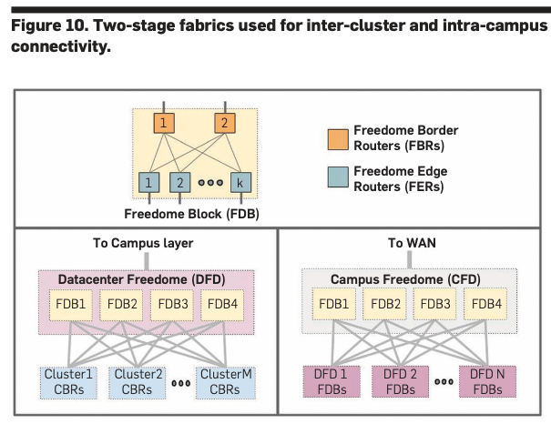

### SOFTWARE CONTROL


#### 5.1. Discussion

As we set out to build the control plane for our network hard-
ware, we faced the following high level trade-off: deploy tra-
ditional decentralized routing protocols such as OSPF/IS-IS/
BGP to manage our fabrics or build a custom control plane
to leverage some of the unique characteristics and homoge-
neity of our cluster network.
We chose to build our own control plane for a num-
ber of reasons. First, and most important, existing rout-
ing protocols did not, at the time, have good support for
multi-path, equal-cost forwarding. Second, there were
no high quality open source routing stacks a decade ago.
Third, we were concerned about the protocol overhead of
running broadcast-based routing protocols across fabrics
with potentially thousands of switching elements. Scaling
techniques like OSPF Areas19 appeared hard to configure
and to reason about.22 Fourth, network manageability
was a key concern and maintaining hundreds of indepen-
dent switch stacks and, for example, BGP configurations
seemed daunting.

当我们开始为网络硬件构建控制平面时，我们面临着以下高级权衡：部署传统的去中心化路由协议，如OSPF/IS-IS/BGP来管理我们的结构，或构建一个自定义控制平面，以利用我们集群网络的一些独特特性和同质性。我们选择建造自己的控制平面有很多原因。首先，也是最重要的，现有的路由协议当时对多路径、等成本转发没有很好的支持。其次，十年前没有高质量的开源路由堆栈。第三，我们担心跨具有数千个交换元素的结构运行基于广播的路由协议的协议开销。像OSPF Areas19这样的扩展技术似乎很难配置和推理。22第四，网络可管理性是一个关键问题，维护数百个獨立交换机堆栈，例如，BGP配置似乎令人生畏。

Our approach was driven by the need to route across a
largely static topology with massive multipath. Each switch
had a predefined role according to its location in the fabric
and could be configured as such. A centralized solution where
a route controller collected dynamic link state information
and redistributed this link state to all switches over a reliable out-of-band Control Plane Network (CPN) appeared to be
substantially simpler and more efficient from a computation
and communication perspective. The switches could then
calculate forwarding tables based on current link state as del-
tas relative to the underlying, known static topology that was
pushed to all switches.
Overall, we treated the datacenter network as a single
fabric with tens of thousands of ports rather than a col-
lection of hundreds of autonomous switches that had to
dynamically discover information about the fabric. We
were, at this time, inspired by the success of large-scale dis-
tributed storage systems with a centralized manager.13 Our
design informed the control architecture for both Jupiter
datacenter networks and Google’s B4 WAN,17 both of which
are based on OpenFlow18 and custom SDN control stacks.

我们的方案源于需要在具有大量多路径的、拓扑结构基本保持不变的网络中进行路由的需求。每个交换机根据其在网络结构中的位置具有预定义的角色，并可以进行相应的配置。一种集中式解决方案似乎在计算和通信方面更加简单高效：路由控制器收集动态链路状态信息，并通过可靠的带外控制平面网络（CPN）将这些链路状态信息分发给所有交换机。然后，交换机可以根据当前链路状态计算转发表，这些转发表是相对于推送给所有交换机的底层已知静态拓扑的增量。
总体而言，我们将数据中心网络视为一个拥有数万个端口的单一网络结构，而不是数百个必须动态发现网络结构信息的自治交换机的集合。当时，我们受到了大型分布式存储系统及其集中式管理器的成功经验的启发。13 我们的设计为 Jupiter 数据中心网络和 Google 的 B4 广域网17 的控制架构提供了参考，这两个网络都基于 OpenFlow18 和定制的 SDN 控制堆栈。

#### 5.2. Routing

在 5.2 节中，源码详细介绍了 Google 为其数据中心织网（Fabric）开发的定制化路由架构——**Firepath**。这一节展示了 Google 如何将“逻辑中心化”的思维应用于大规模三层（Layer 3）路由控制。

以下是Firepath 路由架构的核心组成部分与运作机制：

**1. 邻居发现协议 (Neighbor Discovery, ND)**
由于 Clos 织网涉及数千根电缆，人工插线极易出错。ND 协议是确保物理连接与逻辑拓扑一致的“第一道防线”：
- 功能：它是一种在线存活性和对端正确性检查协议。
- 机制：每个交换机会根据预先加载的“集群配置”获知自己理论上的邻居 ID，并与通过端口实际探测到的 ID 进行比对。
- 作用：如果发现插错线（Miscabled）或链路出现单向故障，ND 会自动禁用该链路，从而防止转发环路和数据丢失。

**2. Firepath：中心化分发与分布式计算**
Firepath 并没有采用完全的分布式协议，而是采用了一种混合模式：
- Master-Client 架构：Firepath Client 运行在所有交换机上，而一组冗余的 Firepath Master 则运行在选定的骨干交换机（Spine）上。
- 控制路径：所有路由信息的交换都通过独立的带外控制平面网络（CPN）进行，以确保通信的高可靠性和高效率。
- 数据同步：
  - 收集状态：每个 Client 将本地接口状态上报给 Master。
  - 生成全图：Master 汇总生成链路状态数据库 (LSD)，并分配一个单调递增的版本号。
  - 多播分发：Master 将 LSD（整个网络的数据包通常小于 64 KB）通过 UDP 多播推送到所有 Client。
  - 本地决策：Client 收到全局地图后，会在本地独立执行最短路径计算（基于 ECMP 等价多路径）并更新硬件转发表。

> [!note]
> 那么看到这里，可以总结出，这个master，也就是大脑，是非常重要的。

**3. Master 冗余与稳定性 (FMRP)**
为了防止“大脑”故障导致网络瘫痪，Google 设计了 **Firepath Master Redundancy Protocol (FMRP)**：
- 选举机制：在多台预设的 Spine 交换机中选举出活动主控。
- “粘性”特性 (Sticky)：FMRP 的选举是粘性的，这意味着即使有其他潜在的 Master 候选者出现异常，只要当前的 Master 正常工作，系统就不会轻易切换，从而避免了不必要的网络震荡（Churn）。

**4. 集群边界路由 (CBR) 的集成**
Firepath 仅用于数据中心内部，与外部世界的通信则由 CBR 负责：
- **协议转换**：CBR 上运行着一个**代理进程**，负责在内部的 Firepath 和外部的标准 BGP 之间交换路由信息。
- **路由简化**：为了提高效率，内部 Firepath 只需要处理一条指向 CBR 的默认路由（/0），而 CBR 则向外部 BGP 宣告整个集群的网段前缀。

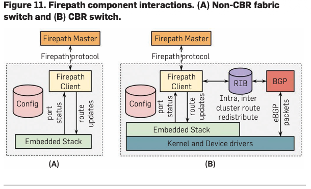

第四部分也就是这里的图B。

A是很好理解的。

We now present the key components of Firepath, our routing
architecture for Firehose, Watchtower, and Saturn fabrics.
A number of these components anticipate some of the prin-
ciples of modern SDN, especially in using logically central-
ized state and control. First, all switches are configured with
the baseline or intended topology. The switches learn actual
configuration and link state through pair-wise neighbor
discovery. Next, routing proceeds with each switch exchang-
ing its local view of connectivity with a centralized Firepath
master, which redistributes global link state to all switches.
Switches locally calculate forwarding tables based on this
current view of network topology. To maintain robust-
ness, we implement a Firepath master election protocol.
Finally, we leverage standard BGP only for route exchange
at the edge of our fabric, redistributing BGP-learned routes
through Firepath.

我们现在介绍Firepath的关键组件，Firepath是我们Firehose、Watchtower和Saturn Fabrics的路由架构。其中一些组件预测了现代SDN的一些原则，特别是在使用逻辑集中状态和控制方面。首先，所有交换机都配置了基线或预期拓扑结构。交换机通过成对的邻居发现来学习实际配置和链路状态。接下来，路由继续进行，每个交换机将其本地连接视图与集中的Firepath主站交换，该主站将全局链路状态重新分配到所有交换机。交换机根据当前网络拓扑视图在本地计算转发表。为了保持稳健性，我们实施了Firepath主选举协议。最後，我們僅利用標準BGP在結構邊緣進行路由交換，透過Firepath重新分配BGP學習的路由。

Neighbor discovery to verify connectivity. Building a
fabric with thousands of cables invariably leads to mul-
tiple cabling errors. Moreover, correctly cabled links may
be re-connected incorrectly after maintenance. Allow-
ing traffic to use a miscabled link can lead to forwarding
loops. Links that fail unidirectionally or develop high
packet error rates should also be avoided and scheduled
for replacement. To address these issues, we developed
Neighbor Discovery (ND), an online liveness and peer cor-
rectness checking protocol. ND uses the configured view
of cluster topology together with a switch’s local ID to de-
termine the expected peer IDs of its local ports and veri-
fies that via message exchange.


邻居发现以验证连接。用数千根电缆构建结构无一例外会导致多个布线错误。此外，正确的电缆链路可能会在维护后错误地重新连接。允许流量使用错误的链接可能会导致转发循环。也应避免单向故障或产生高数据包错误率的链路，并安排更换。为了解决这些问题，我们开发了Neighbor Discovery（ND），这是一个在线实时性和对等性检查协议。ND使用集群拓扑的配置视图和交换机的本地ID来确定其本地端口的预期对等ID，并通过消息交换进行验证。

> [!note]
> 这个邻居认证，就是检查我的邻居是不是我应有的邻居，如果我的邻居错了，表示插错线。


Firepath. We support Layer 3 routing all the way to the
ToRs via a custom Interior Gateway Protocol (IGP), Firepath.
Firepath implements centralized topology state distribu-
tion, but distributed forwarding table computation with
two main components. A Firepath client runs on each fabric
switch, and a set of redundant Firepath masters run on a
selected subset of spine switches. Clients communicate
with the elected master over the CPN. Figure 11 shows
the interaction between the Firepath client and the rest of
the switch stack. Figure 12 illustrates the protocol message
exchange between various routing components.

我们通过自定义内部网关协议（IGP）Firepath支持第3层路由到ToR。Firepath实现了集中式拓扑状态分布，但分布式转发表计算有两个主要组件。Firepath客户端在每个结构交换机上运行，一组冗余的Firepath主服务器在选定的脊柱交换机子集上运行。客户通过CPN与当选的大师进行沟通。图11显示了Firepath客户端与交换机堆栈其余部分之间的交互。图12说明了各种路由组件之间的协议消息交换。

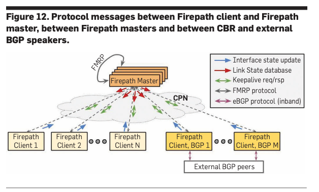


At startup, each client is loaded with the static topology
of the entire fabric called the cluster config. Each client collects the state of its local interfaces from the embedded
stack’s interface manager and transmits this state to the
master. The master constructs a Link State Database (LSD)
with a monotonically increasing version number and dis-
tributes it to all clients via UDP/IP multicast over the CPN.
After the initial full update, a subsequent LSD contains only
the diffs from the previous state. The entire network’s LSD
fits within a 64 KB payload. On receiving an LSD update,
each client computes shortest path forwarding with Equal-
Cost Multi-Path (ECMP) and programs the hardware for-
warding tables local to its switch.

启动时，每个客户端都会加载整个网络的静态拓扑结构，称为集群配置。每个客户端从嵌入式协议栈的接口管理器收集其本地接口的状态，并将此状态传输给主节点。主节点构建一个具有单调递增版本号的链路状态数据库 (LSD)，并通过 CPN 网络上的 UDP/IP 多播将其分发给所有客户端。初始完整更新后，后续的 LSD 只包含与先前状态的差异。整个网络的 LSD 数据大小不超过 64 KB。收到 LSD 更新后，每个客户端都会使用等价多路径 (ECMP) 算法计算最短路径转发，并配置其交换机本地的硬件转发表。

> [!note]
> master告诉client现在链路情况的包包，很小，不会超过64kb。是因为这个东西包含LSD，然后只包含和之前状态的差异，所以比较小。

Path diversity and convergence on failures. For rapid con-
vergence on interface state change, each client computes
the new routing solution and updates the forwarding tables
independently upon receiving an LSD update. Since clients
do not coordinate during convergence, the network can
experience small transient loss while the network transi-
tions from the old to the new state. However, assuming
churn is transient, all switches eventually act on a globally
consistent view of network state.
Firepath LSD updates contain routing changes due to
planned and unplanned network events. The frequency of
such events observed in a typical cluster is approximately 2000
times/month, 70 times/day, or 3 times/hour.

路径多样性和失败的趋同。为了快速融合接口状态变化，每个客户端计算新的路由解决方案，并在收到LSD更新后独立更新转发表。由于客户端在收敛期间不协调，网络在从旧状态过渡到新状态时可能会经历小瞬态损失。然而，假设流失是瞬态的，所有交换机最终都会以全球一致的网络状态视图行事。Firepath LSD更新包含因计划内和计划外的网络事件而导致的路由更改。在典型的集群中观察到的此类事件的频率约为2000次/月、70次/天或3次/小时。

Firepath master redundancy The centralized Firepath
master is a critical component in the Firepath system. It col-
lects and distributes interface states and synchronizes the
Firepath clients via a keepalive protocol. For availability,
we run redundant master instances on pre-selected spine
switches. Switches know the candidate masters via their
static configuration. The Firepath Master Redundancy Pro-
tocol (FMRP) handles master election and bookkeeping
between the active and backup masters over the CPN.
FMRP has been robust in production over multiple years
and many clusters. Since master election is sticky, a mis-
behaving master candidate does not cause changes in
mastership and churn in the network. In the rare case
of a CPN partition, a multi-master situation may result,
which immediately alerts network operators for man-
ual intervention.

静态配置。Firepath主冗余协议（FMRP）通过CPN处理活动主站和备份主站之间的主选择和簿记。多年来，FMRP在生产和许多集群中都很强劲。由于大师选举很棘手，行为不端的大师候选人不会改变网络中的大师和流失。在CPN分区的极少数情况下，可能会发生多主处理情况，这会立即提醒网络运营商进行人工干预。


Cluster border router. Our cluster fabrics peer with exter-
nal networks via BGP. To this end, we integrated a BGP stack
on the CBR with Firepath. This integration has two key as-
pects: (i) enabling the BGP stack on the CBRs to communi-
cate inband with external BGP speakers, and (ii) supporting
route exchange between the BGP stack and Firepath. Figure
11B shows the interaction between the BGP stack, Firepath,
and the switch kernel and embedded stack.
A proxy process on the CBR exchanges routes between
BGP and Firepath. This process exports intra-cluster routes
from Firepath into the BGP RIB and picks up inter-cluster
routes from the BGP RIB, redistributing them into Firepath.
We made a simplifying assumption by summarizing routes
to the cluster-prefix for external BGP advertisement and the
/0 default route to Firepath. In this way, Firepath manages
only a single route for all outbound traffic, assuming all
CBRs are viable for traffic leaving the cluster. Conversely, we
assume all CBRs are viable to reach any part of the cluster
from an external network. The rich path diversity inherent to
Clos fabrics enables both these assumptions.


集群边界路由器。我们的集群结构通过BGP与外部网络对等。为此，我们在CBR上与Firepath集成了BGP堆栈。这种整合有两个关键方面：（i）使CBR上的BGP堆栈能够与外部BGP扬声器在波段内通信，以及（ii）支持BGP堆栈和Firepath之间的路由交换。图11B显示了BGP堆栈、Firepath以及交换机内核和嵌入式堆栈之间的交互。BGP和Firepath之间的CBR交换路由上的代理进程。此过程将集群内路由从Firepath导出到BGP RIB，并从BGP RIB中拾取集群间路由，将它们重新分配到Firepath中。我们通过将路由总结到外部BGP广告的集群前缀和/0默认路由到Firepath，做出了一个简化的假设。通过这种方式，假设所有CBR对离开集群的流量都是可行的，Firepath只管理所有出站流量的单一路线。相反，我们假设所有CBR都可以从外部网络到达集群的任何部分。Clos织物固有的丰富路径多样性使这两个假设成为可能。

#### 5.3. Configuration and management

Next, we describe our approach to cluster network configu-
ration and management prior to Jupiter. Our primary goal
was to manufacture compute clusters and network fabrics as
fast as possible throughout the entire fleet. Thus, we favored
simplicity and reproducibility over flexibility. We supported
only a limited number of fabric parameters, used to gener-
ate all the information needed by various groups to deploy
the network, and built simple tools and processes to operate
the network. As a result, the system was easily adopted by a
wide set of technical and non-technical support personnel
responsible for building data centers.

接下来，我们描述了我们在木星之前对集群网络配置和管理的方法。我们的主要目标是在整个车队中尽可能快地制造计算集群和网络结构。因此，我们更喜欢简单性和可重复性而不是灵活性。我们只支持数量有限的结构参数，用于生成各组部署网络所需的所有信息，并构建简单的工具和流程来操作网络。因此，该系统很容易被负责建设数据中心的大量技术和非技术支持人员采用。

Configuration generation approach. Our key strategy was
to view the entire cluster network top-down as a single static
fabric composed of switches with pre-assigned roles, rath-
er than bottom-up as a collection of switches individually
configured and assembled into a fabric. We also limited the
number of choices at the cluster-level, essentially providing
a simple menu of fabric sizes and options, based on the pro-
jected maximum size of a cluster as well as the chassis type
available.

配置生成方法。我们的关键策略是将整个集群网络自上而下视为由具有预先分配角色的交换机组成的单一静态结构，而不是自下而上作为单独配置和组装成结构的交换机集合。我们还限制了集群级别的选择数量，基本上根据集群的最大尺寸以及可用的机箱类型，提供了一个简单的织物尺寸和选项菜单。

The configuration system is a pipeline that accepts a
specification of basic cluster-level parameters such as the
size of the spine, base IP prefix of the cluster and the list of
ToRs and their rack indexes and then generates a set of out-
put files for various operations groups.

配置系统是一个管道，它接受基本集群级参数的规范，如脊柱的大小、集群的基本IP前缀以及ToR列表及其机架索引，然后为各种操作组生成一组输出文件。

We distribute a single monolithic cluster configuration
to all switches (chassis and ToRs) in the cluster. Each switch
simply extracts its relevant portion. Doing so simplifies con-
figuration generation but every switch has to be updated with
the new config each time the cluster configuration changes.
Since cluster configurations do not change frequently, this
additional overhead is not significant.

我们将单个整体集群配置分配给集群中的所有交换机（机箱和ToR）。每个开关只是提取其相关部分。这样做简化了配置生成，但每次集群配置更改时，每个交换机都必须使用新配置进行更新。由于集群配置不会频繁变化，因此这种额外的开销并不显著。

Switch management approach. We designed a simple man-
agement system on the switches. We did not require most of
the standard network management protocols. Instead, we
focused on protocols to integrate with our existing server
management infrastructure. We benefited from not draw-
ing arbitrary lines between server and network infrastruc-
ture; in fact, we set out to make switches essentially look like
regular machines to the rest of fleet. Examples include large
scale monitoring, image management and installation, and
syslog collection and alerting.
Fabric operation and management. For fabric operation
and management, we continued with the theme of lever-
aging the existing scalable infrastructure built to manage
and operate the server fleet. We built additional tools that
were aware of the network fabric as a whole, thus hiding
complexity in our management software. As a result, we
could focus on developing only a few tools that were truly
specific to our large scale network deployments, including
link/switch qualification, fabric expansion/upgrade, and
network troubleshooting at scale. Also important was col-
laborating closely with the network operations team to pro-
vide training before introducing each major network fabric
generation, expediting the ramp of each technology across
the fleet.
Troubleshooting misbehaving traffic flows in a network
with such high path diversity is daunting for operators.
Therefore, we extended debugging utilities such as tracer-
oute and ICMP to be aware of the fabric topology. This helped
with locating switches in the network that were potentially
blackholing flows. We proactively detect such anomalies by
running probes across servers randomly distributed in the
cluster. On probe failures, these servers automatically run
traceroutes and identify suspect failures in the network.


交换机管理方法。我们在开关上设计了一个简单的管理系统。我们不需要大多数标准网络管理协议。相反，我们专注于与我们现有的服务器管理基础设施集成的协议。我们受益于没有在服务器和网络基础设施之间划定任意界限；事实上，我们着手使交换机对车队的其他部分来说基本上看起来像普通机器。示例包括大规模监控、图像管理和安装，以及系统日志收集和警报。织物操作和管理。对于结构运营和管理，我们继续利用现有的可扩展基础设施来管理和运营服务器车队的主题。我们构建了其他工具，这些工具了解整个网络结构，从而隐藏了管理软件的复杂性。因此，我们可以只专注于开发一些真正特定于我们大规模网络部署的工具，包括链接/交换器资格、结构扩展/升级和大规模网络故障排除。同样重要的是，与网络运营团队密切合作，在引入每个主要网络结构生成之前提供培训，加快整个车队的每项技术的坡道。对具有如此高路径多样性的网络中错误的流量进行故障排除对运营商来说是令人生畏的。因此，我们扩展了tracer-oute和ICMP等调试实用程序，以了解结构拓扑结构。这有助于在网络中定位可能是黑洞流的交换机。我们通过在集群中随机分布的服务器上运行探针来主动检测此类异常情况。在探测失败时，这些服务器会自动运行跟踪路由，并识别网络中的可疑故障。

***

这一部分（5.3. Configuration and management）主要讲述了 Google **如何高效地配置和管理成千上万台交换机**。

核心思想非常简单粗暴：**不要把交换机当成特殊的网络设备，要把它们当成普通的服务器来管理；不要一台台配置，要全网统一分发。**

**1. 配置哲学：自上而下的“单体”视**角
- 目标：为了能快速复制和部署集群，Google 选择了“简单和可复制性”优先于“灵活性”。
- 视角转变：他们不再采用“自下而上”的方式（即分别配置每一台交换机然后组网），而是采用“自上而下”的方式。
- 单一织网：整个集群被视为一个巨大的静态织网（Single Static Fabric），每台交换机在出厂前就已经被分配好了特定的角色（Role），而不是等上线了再通过协议去协商。

**2. "巨型配置文件" (Monolithic Config)**
这是 Google 配置管理中最独特的一点：
*   生成方式：系统根据几个基本参数（如 Spine 的大小、IP 前缀、ToR 列表）自动生成配置。
*   分发方式：系统生成一份单一的、包含整个集群所有信息的配置文件，然后分发给集群里的每一台交换机。
*   各取所需：交换机收到这个巨大的文件后，根据自己的 ID，从中提取出属于自己的那一部分配置来执行。
*   好处：极大地简化了配置生成流程，保证了全网配置的一致性。

**3. 像管理服务器一样管理交换机**
*   去特殊化：Google 没有使用传统的网络管理协议（如 SNMP 等复杂协议），而是打破了服务器和网络设备的界限。
*   工具复用：直接使用管理服务器集群的现成工具来管理交换机。这意味着交换机的镜像安装、监控、日志收集（syslog）和报警，用的都是和普通服务器一样的系统。

**4. 故障排查：全网感知**
*   专用工具：开发了能感知“整个织网拓扑”的工具，而不是只看单点的工具。
*   魔改 Traceroute：Google 修改了标准的 `traceroute` 和 `ICMP` 工具，让它们能理解 Clos 拓扑，从而快速定位是哪台交换机把数据包“黑洞”掉了。
*   主动探测：系统会随机在服务器之间运行探测程序，一旦发现网络不通，自动触发 traceroute 锁定故障点。


> [!important]
> 反正这一章的核心就是：把网络看作一个整体（单体配置），并将交换机贬为“普通服务器”（复用服务器运维工具）


### EXPERIENCE

这一节主要分享了 Google 在长期运维这些大规模网络中积累的实战经验，特别是他们遇到的具体困难（踩过的坑）解决方案。

主要分为两个方面：

**1. 对抗网络拥塞 (Fabric Congestion)**

哪怕带宽再大，只要利用率到了 25% 左右，依然会出现严重的丢包问题。
- 原因：突发流量（Incast/Outcast）、商用交换机缓存小、哈希冲突等。
- 解决手段：Google 没有去买昂贵的大缓存交换机，而是通过软件调优解决：
  - QoS：优先丢弃低优先级的数据包。
  - ECN：开启显式拥塞通知，让服务器端感知拥塞并减速。
  - TCP 调优：限制 TCP 窗口大小，防止把交换机缓存撑爆。
- 结果：丢包率从 1% 降到了 0.01% 以下。

**2. 应对重大故障 (Outages)**

虽然整体稳定，但他们也遇到过三类典型的大故障：

- 控制软件崩溃（死锁）：有一次停电导致全网重启，结果因为路由计算抢占了 CPU，导致邻居发现协议（ND）超时，网络陷入了“启动-崩溃-再启动”的死循环（Snowball effect）。教训：要在虚拟环境中进行大规模压力测试。
- 硬件老化：备用的冗余链路（Redundant links）悄悄坏了没人发现，等到主链路坏的时候才发现备用的也用不了。教训：必须主动监控所有主备链路的健康状态。
- 配置失误：运维工具没写好（没加锁），读取到了正在修改中的“半成品”配置文件，导致 BGP 路由混乱。教训：工具必须做得更安全、更健壮。
简而言之：这一节告诉我们，光有好的架构（Clos + 集中控制）还不够，还需要精细的流量控制（拥塞管理）和极其严谨的运维工具（防故障），才能让这个巨兽稳定运行。


## Jupiter Envolving

### Jupiter Envolving 和 Jupiter Rising 的关系

**《Jupiter Evolving》概要：它在干什么？**

简单来说，《Jupiter Evolving》介绍了 Google 数据中心网络在过去十年中如何从**静态的 Clos 架构**彻底转型为**基于光路交换（OCS）的动态“直连”（Direct-Connect）架构**。

这篇论文的核心在于解决“如何在一个这就规模的网络中进行低成本、无缝的技术迭代”这个问题。它主要干了这几件事：

*   引入光路交换层（DCNI）： 它用基于 MEMS 的光路交换机（Optical Circuit Switches, OCS）取代了传统的电子 Spine 交换机层。这一层被称为数据中心互连层（DCNI）。
*   实现“直连”拓扑（Direct-Connect Topology）： 通过 OCS，聚合块（Aggregation Blocks）之间不再通过 Spine 交换机转发流量，而是直接物理互连。这种拓扑不再是固定的，而是可以通过软件重构的。
*   软件定义拓扑（Topology Engineering）： 除了传统的流量工程（Traffic Engineering, TE），系统现在还进行“拓扑工程”（Topology Engineering）。SDN 控制器会根据实时的流量需求矩阵，动态调整 OCS 的光路连接，改变网络物理拓扑来匹配流量模式。
*   支持异构与渐进式升级： 新架构允许不同速率（40G, 100G, 200G, 400G 等）的聚合块在同一个网络中共存并全速运行，解决了旧架构中新硬件必须降速以适应旧 Spine 的问题。

成果： 这种架构实现了 5 倍的带宽容量增长，减少了 30% 的资本支出（Capex）和 41% 的电力消耗。

**《Jupiter Evolving》与《Jupiter Rising》的关系**

《Jupiter Evolving》并不是推翻《Jupiter Rising》，而是对其架构中无法避免的“生命周期管理”和“物理扩展”瓶颈进行的进化（Evolution）。

**A. 拓扑结构的根本转变：从 Clos 到 Direct-Connect**
*   Jupiter Rising (2015): 建立了基于商用芯片的 Clos 拓扑（Spine-Leaf 架构的变体）。其核心思想是通过大量的 Spine 交换机提供无阻塞的带宽。所有的聚合块（Aggregation Blocks）都必须连接到统一的 Spine 层。
*   Jupiter Evolving (2022): 发现 Clos 架构在长期运营中存在巨大缺陷。为了维持无阻塞网络，必须预先建设庞大的 Spine 层。新论文提出**拆除 Spine 层**，利用 OCS 让聚合块之间直接互连（Direct Connect）。

**B. 解决“代际升级”的痛点（核心驱动力）**
*   Jupiter Rising: 这种架构在单一技术时代（如全网 40G）表现良好。但当试图引入新技术（如 100G）时，遇到了麻烦。如果 Spine 还是 40G，新接入的 100G 聚合块必须降速（Derating）运行，导致昂贵的服务器资源被闲置浪费。
*   Jupiter Evolving: 解决了这个问题。通过 OCS，网络不再依赖中心化的电子 Spine 交换机。40G 的块可以和 40G 的块互连，200G 的块可以和 200G 的块全速互连。网络可以像搭积木一样，随时插入不同速率的新一代硬件，而无需“整网翻新”。

**C. 控制平面的进化：从路由控制到物理控制**
*   Jupiter Rising: 引入了集中式的 SDN 控制（Firepath），主要负责路由（Routing）和配置管理。它在一个**静态**的物理拓扑上计算转发表。
*   Jupiter Evolving: 将 SDN 的能力扩展到了**物理层**。控制平面不仅决定数据包怎么走（流量工程），还决定物理链路怎么连（拓扑工程）。它会根据哪里流量大，就通过 OCS 在哪里动态增加物理直连链路。

**D. 硬件实现的互操作性**
*   Jupiter Rising: 依赖商用交换机芯片构建 Spine 和聚合块。
*   Jupiter Evolving: 保留了聚合块使用商用芯片的传统，但在互连层引入了自研的光路交换机（OCS）和波分复用（WDM）光模块。为了节省光纤资源，还引入了光环形器（Circulators）来实现单根光纤的双向传输。

### 总结
如果你把 **Jupiter Rising** 看作是 Google 证明了“用廉价商用芯片+集中控制软件可以造出超大规模数据中心网络”，那么 **Jupiter Evolving** 就是 Google 回答了“当这个庞然大物运行了十年，面对每两年翻一番的带宽需求和不断更新的硬件标准，我们该如何低成本、不亦乐乎地修缮和升级它”。

《Jupiter Evolving》实际上是用**光学技术（OCS）**和**更高级的算法（拓扑工程）**去解决《Jupiter Rising》遗留下的物理扩展性和代际兼容性问题。


### 我的一些简单理解 before reading

我在看之前先简单理解一下，在 jupiter rising时代，google通过把东西写死（提前给每个交换机提供一个静态地图）这样他们就不用建图，从而对比之前获得一个大提升。
在 jupiter envolving时代，这个静态地图变成了（可以操控的，动态地图）也就是这个拓扑是可以改变的！
比如，在 rising 时代，a链路拥塞了，通过地图计算，就可以把包发到另外的链路上。但是在 envolving时代，a链路拥塞了，甚至可以控制给a链路添加链路，从而缓解a的拥塞。是这样吗？

是的✅


**1. Jupiter Rising 时代：把地图写死（Static Map）** 

你的理解： “把东西写死……不用建图，从而获得大提升。”
原文验证：
- 是这样吗？ 是的。在 Jupiter Rising 中，Google 意识到传统网络协议（如 OSPF/IS-IS）需要交换机之间互相广播来“探路”和“画地图”，这在超大规模网络中效率极低且难以管理。
- Google 怎么做？ 他们把整个数据中心网络看作一个单一的静态架构。所有的交换机角色和连接关系都是预先定义好的（Pre-defined）。
- 如何运作？ Google 建立了一个中央控制器（Firepath Master），它不需要去“发现”拓扑，因为人类已经把这张“静态地图”（Cluster Config）推送到每一个交换机里了。交换机只需要汇报“我的接口是不是亮的”，控制器就能立刻计算出全局路由。
- 提升在哪里？ 这种做法极大地简化了控制平面，让 Google 能够用廉价的商用芯片构建出巨大的 Clos 网络，而不必担心传统协议的广播风暴或收敛过慢的问题。

**2. Jupiter Evolving 时代：动态地图与拓扑工程（Dynamic Topology）**
你的理解： “地图变成了可以操控的……a链路拥塞了，甚至可以控制给a链路添加链路。”

原文验证：
- 是这样吗？ 是的，这正是 Jupiter Evolving 最核心的创新，被称为拓扑工程（Topology Engineering）。
- 硬件基础： 为了实现这一点，Google 引入了光路交换机（OCS）。以前两条线连在一起就是物理锁死的；现在通过 OCS，软件可以控制光的折射方向，物理上改变哪两台设备相连。
- 拥塞处理的进化（Rising vs. Evolving）：
  - 在 Rising 时代（以及 Evolving 中的流量工程 TE）： 如果 A 链路拥塞，系统只能做“分流”。即把一部分数据包通过 B、C 等其他现有的路径绕过去。这叫流量工程（Traffic Engineering），是改变数据包的走法。
  - 在 Evolving 时代（拓扑工程 ToE）： 如果 A 链路（比如 Block 1 到 Block 2）长期拥塞，且 Block 1 到 Block 3 很空闲。系统可以控制 OCS，拔掉几根连接 Block 3 的光纤，插到 Block 2 上去（逻辑上的“拔插”）。这样，Block 1 到 Block 2 的物理带宽（车道数）直接增加了。这叫拓扑工程，是改变物理道路的铺法。

**需要补充的一个细节：时间尺度**

**虽然你的理解在逻辑上完全正确，但在实际运作的时间快慢上，论文中有一个重要的区分：**
- 流量工程（Traffic Engineering，改路由）： 反应非常快（秒级到分钟级）。如果突发拥塞，先靠它救急，把包发到别的路上去。
- 拓扑工程（Topology Engineering，改物理链路）： 反应相对较慢（通常是小时级或天级，虽然 OCS 切换本身很快）。Google 发现流量模式的变化通常比较缓慢，所以不需要每秒钟都在那儿疯狂“修路”。系统会根据一段时间的预测，重新调整一次物理拓扑。


### Abstract

We present a decade of evolution and production experiencewith Jupiter datacenter network fabrics. In this period Jupiterhas delivered 5x higher speed and capacity, 30% reduction incapex, 41% reduction in power, incremental deployment andtechnology refresh all while serving live production traffic. Akey enabler for these improvements is evolving Jupiter from aClos to a direct-connect topology among the machine aggrega-tion blocks. Critical architectural changes for this include: Adatacenter interconnection layer employing Micro-Electro-Mechanical Systems (MEMS) based Optical Circuit Switches(OCSes) to enable dynamic topology reconfiguration,central-ized Software-Defined Networking(SDN) control for trafficengineering, and automated network operations for incre-mental capacity delivery and topology engineering. We showthat the combination of traffic and topology engineering ondirect-connect fabrics achieves similar throughput as Closfabrics for our production traffic patterns. We also optimizefor path lengths: 60% of the traffic takes direct path fromsource to destination aggregation blocks, while the remain-ing transits one additional block, achieving an average block-level path length of 1.4 in our fleet today. OCS also achieves3x faster fabric reconfiguration compared to pre-evolutionClos fabrics that used a patch panel based interconnect.

我们展示了 Jupiter 数据中心网络架构十年的发展历程和生产经验。在此期间，Jupiter 实现了速度和容量提升 5 倍、资本支出降低 30%、功耗降低 41%，并实现了增量部署和技术更新，同时持续服务于实时生产流量。实现这些改进的关键在于将 Jupiter 的网络拓扑结构从 Clos 架构演进为机器聚合块之间的直连拓扑。为此，我们进行了关键的架构改进，包括：采用基于微机电系统 (MEMS) 的光路交换机 (OCS) 构建数据中心互连层，以实现动态拓扑重构；采用集中式软件定义网络 (SDN) 控制进行流量工程；以及采用自动化网络运维实现增量容量交付和拓扑工程。我们证明，对于我们的生产流量模式，在直连网络架构上结合流量工程和拓扑工程可以实现与 Clos 架构类似的吞吐量。我们还优化了路径长度：60% 的流量直接从源聚合块传输到目标聚合块，其余流量仅经过一个额外的聚合块，目前我们的网络平均块级路径长度为 1.4。与采用跳线面板互连的早期 Clos 架构相比，OCS 的网络重构速度提高了 3 倍。

### Intro

Software-Defined Networking and Clos topologies [1, 2, 14,
24, 33] built with merchant silicon have enabled cost effec-
tive, reliable building-scale datacenter networks as the basis
for Cloud infrastructure. A range of networked services, ma-
chine learning workloads, and storage infrastructure lever-
age uniform, high bandwidth connectivity among tens of
thousands of servers to great effect.

使用商家硅构建的软件定义网络和Clos拓扑[1、2、14、24、33]使具有成本效益、可靠的建筑规模数据中心网络成为云基础设施的基础。一系列网络服务、机器学习工作负载和存储基础设施利用数以万计的服务器之间的统一、高带宽连接，效果极佳。

While there is tremendous progress, managing the het-
erogeneity and incremental evolution of a building-scale
network has received comparatively little attention. Cloud
infrastructure grows incrementally, often one rack or even
one server at a time. Hence, filling an initially empty building
takes months to years. Once initially full, the infrastructure
evolves incrementally, again often one rack at a time with
the latest generation of server hardware. Typically there is
no in advance blueprint for the types of servers, storage,
accelerators, or services that will move in or out over the
lifetime of the network. The realities of exponential growth
and changing business requirements mean that the best laid
plans quickly become outdated and inefficient, making in-
cremental and adaptive evolution a necessity.

雖然取得了巨大的進展，但管理建築規模網路的異質性和增量演變卻很少受到關注。云基础设施逐步增长，通常一次一个机架甚至一个服务器。因此，填补最初空置的建筑需要几个月到几年的时间。一旦最初满员，基础设施就会逐步演变，同样，通常一次一个机架，使用最新一代的服务器硬件。通常，对于在网络生命周期内进出的服务器、存储、加速器或服务类型，没有事先的蓝图。指数增长和不断变化的业务需求的现实意味着，制定最好的计划很快就会变得过时和效率低下，使增量和适应性演变成为必要。


Incremental refresh of compute and storage infrastructure
is relatively straightforward: drain perhaps one rack’s worth
of capacity among hundreds or thousands in a datacenter and
replace it with a newer generation of hardware. Incremental
refresh of the network infrastructure is more challenging
as Clos fabrics require pre-building at least the spine layer
for the entire network. Doing so unfortunately restricts the
datacenter bandwidth available to the speed of the network
technology available at the time of spine deployment.


计算和存储基础设施的增量更新相对简单：也许在数据中心的数百或数千个存储器中消耗一个机架的容量，然后用更新一代的硬件取代它。网络基础设施的增量更新更具挑战性，因为Clos结构至少需要预建整个网络的骨干层。不幸的是，这样做将数据中心可用的带宽限制在脊柱部署时可用的网络技术的速度。


Consider a generic 3-tier Clos network comprising ma-
chine racks with top-of-the-rack switches (ToRs), aggrega-
tion blocks connecting the racks and spine blocks connecting
the aggregation blocks (Fig 1). A traditional approach to Clos
will require pre-building spine at the maximum-scale (e.g., 64
aggregation blocks with Jupiter [33]) using the technology of
the day. With 40Gbps technology, each spine would support
20Tbps burst bandwidth. As the next generation of 100Gbps
becomes available, the newer aggregation blocks can sup-
port 51.2Tbps of burst bandwidth, however, these blocks
would be limited to the 40Gbps link speed of the pre-existing
spine blocks, reducing the capacity to 20Tbps per aggrega-
tion block. Ultimately, individual server and storage capacity
would be derated because of insufficient datacenter network
bandwidth. Increasing compute power without correspond-
ing network bandwidth increase leads to system imbalance
and stranding of expensive server capacity. Unfortunately,
the nature of Clos topologies is such that incremental refresh
of the spine results in only incremental improvement in the
capacity of new-generation aggregation blocks. Refreshing
the entire building-scale spine is also undesirable as it would
be expensive, time consuming, and operationally disruptive
given the need for fabric-wide rewiring.

考虑一个通用的3层Clos网络，包括带有机架顶部开关（ToR）的机架、连接机架的聚合块和连接聚合块的脊柱块（图1）。Clos的传统方法将需要使用当天的技术在最大尺度上预先构建脊柱（例如，64个与木星的聚合块[33]）。使用40Gbps技术，每个脊柱将支持20Tbps的突发带宽。随着下一代100Gbps的出现，较新的聚合块可以支持51.2Tbps的突发带宽，然而，这些块将限制在预先存在的脊柱块的40Gbps链路速度，将容量降低到每个聚合块的20Tbps。最终，由于数据中心网络带宽不足，单个服务器和存储容量将被降级。在不相应增加网络带宽的情况下增加计算能力会导致系统不平衡和昂贵的服务器容量搁浅。不幸的是，Clos拓扑的性质是，脊柱的增量刷新只能导致新一代聚合块容量的增量提高。刷新整个建筑规模的脊柱也是不可取的，因为考虑到需要对织物进行重新布线，这既昂贵又耗时，而且会破坏运营。


We present a new end-to-end design that incorporates
Optical Circuit Switches (OCSes) [31]1 to move Jupiter from
a Clos to a block-level direct-connect topology that elimi-
nates the spine switching layer and its associated challenges
altogether, and enables Jupiter to incrementally incorporate
40Gbps, 100Gbps, 200Gbps, and beyond network speeds. The
direct-connect architecture is coupled with network man-
agement, traffic and topology engineering techniques that
allow Jupiter to cope with the traffic uncertainty, substantial
fabric heterogeneity, and evolve without requiring any down-
time or service drains. Along with 5x higher speed, capacity,
and additional flexibility relative to the static Clos fabrics,
these changes have enabled architectural and incremental
30% reduction in cost and a 41% reduction in power.
This work does not raise any ethical issues.

我们提出了一种新的端到端设计，该设计结合了光电路交换机（OCSes）[31]1，将木星从Clos移动到块级直接连接拓扑结构，该拓扑结构完全消除了脊柱交换层及其相关挑战，并使木星能够逐步整合40Gbps、100Gbps、200Gbps和超过网络速度。直接连接架构与网络管理、流量和拓扑工程技术相结合，使木星能够应对流量不确定性、结构的实质性异质性，并在不需要任何停机时间或服务消耗的情况下进行进化。与静态Clos织物相比，速度、容量和额外的灵活性提高了5倍，这些变化使建筑和增量成本降低了30%，功率降低了41%。这项工作没有引起任何道德问题。

### JUPITER’S APPROACH TO EVOLUTION

简单来说，这一章就是 Google 在说：“为了让网络能像生物一样进化，而不是每几年推倒重来，我们实际上干了这三件大事。”

以下是这一章节的核心内容概览：

**1. 引入了“数据中心互连层”（DCNI）**
这是对 *Jupiter Rising* 最大的颠覆。
*   动作： 以前用来做核心汇聚的电子 Spine 交换机层被彻底移除了。取而代之的是一个由光路交换机（OCS）组成的物理层，被称为 DCNI (Datacenter Network Interconnection)。
*   目的： 电子 Spine 是固定的，而 OCS 是动态的。通过 OCS，Google 可以在不派人去机房插拔线的情况下，通过软件调整光路，实现聚合块（Aggregation Blocks）之间的“重连”（Restriping）。

**2. 确立了“直连拓扑”（Direct-Connect Topology）**
*   动作： 在 *Jupiter Rising* 中，流量必须走 `Block -> Spine -> Block`。现在，得益于 OCS，聚合块之间实现了逻辑上的直接互连。OCS 只是像镜子一样把光反射过去，逻辑上看起来就像 Block A 直接连到了 Block B。
*   解决了什么痛点？ 解决了旧架构中的**“降速”（Derating）问题**。
    *   在旧架构（Clos）里，如果 Spine 是 40G 的，新买的 100G 聚合块必须降速到 40G 才能接入，导致严重的资源浪费。
    *   在直连架构里，Spine 没了。40G 的块可以找 40G 的块玩，100G 的块可以找 100G 的块全速互联，大家各跑各的速度，互不拖累。

**3. 实现“多代共存”与“低成本”的硬件黑科技**

这一章还介绍了一些具体的硬件工程细节，解释 Google 是如何让这个方案在经济上可行的：
*   多代际互操作性（Multi-generational Interoperability）： 网络中必须允许不同速率的硬件（40G/100G/200G）共存。Google 使用了 CWDM4 光模块标准，使得不同代际的交换机可以在同一个光网络中握手。
*   光环形器（Optical Circulators）： 这是一个关键的省钱手段。OCS 端口很贵，Google 引入了光环形器，实现了在一根光纤上进行双向传输（Bidirectional），从而把需要的 OCS 端口数和光纤数减半。
*   渐进式部署（Incremental Deployment）： 以前建网就像盖楼，必须先把地基（Spine层）一次性建得很大。现在有了 DCNI，Google 可以像搭积木一样，先建 1/8 大小的网络，然后随着需求增加，逐步加到 1/4、1/2 甚至全量，完全按需扩容。


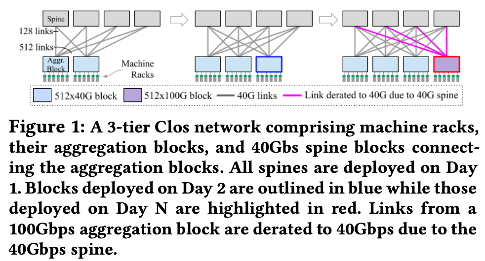

这个图表示的是旧时代的痛。

这张图是什么： 这是一张传统的 3 层 Clos 网络架构图（即 Jupiter Rising 时代的架构）。

- 结构： 最上面是 Spine Block，中间是 Aggregation Block，下面是机架。

它揭示了什么核心问题？ 这张图形象地展示了**“降速”（Derating）**的痛点：
- 观察图的右侧（Day N）： 当你插入一个最新的红色聚合块（比如支持 100G 速率）时，它必须连接到最顶层的灰色 Spine Block。
•- 瓶颈所在： 因为灰色的 Spine 是几年前建好的，只有 40G 的端口速率。
- 后果（粉色线条）： 尽管红色的聚合块有 100G 的能力，但因为 Spine 只有 40G，这条连接只能被迫降速运行在 40G。这导致昂贵的新款交换机和服务器性能被严重浪费（Stranded Capacity）。
- 结论： 在这种架构下，要想升级网络速度，必须把最上面的所有 Spine 交换机全部换掉，这在运营上几乎是不可能的任务。


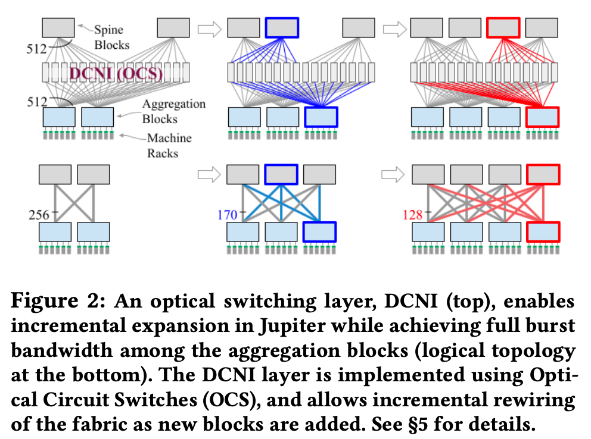

这张图是 Jupiter Evolving 的新架构图。
- 上半部分（物理层）： 原来的电子 Spine 层消失了，取而代之的是 DCNI 层（Datacenter Network Interconnection），由一排排**光路交换机（OCS）**组成。
- 下半部分（逻辑层）： 展示了聚合块之间形成的“直连拓扑”（Direct-Connect Topology）。
- 
它展示了什么解决方案？ 这张图解释了如何实现“多代共存，全速运行”：

- 物理连接（Top）： 所有的聚合块（灰、蓝、红）都连接到中间的 OCS 上。OCS 就像一面镜子，只负责反射光，不在乎光里传输的是 40G 还是 100G 的数据。
- 辑直连（Bottom）：
    - 同代互连： 蓝色的块可以通过 OCS 直接“反射”连到蓝色的块，红色的连红色的。
    - 全速运行： 红色块之间的连接是红色的线（代表 100G 全速），不再受制于任何旧设备。蓝色块之间是蓝色的线。
- 渐进升级： 你可以随时在这个网络里插入一个新的高逮块，它立刻就能以全速和其他同类块通信，完全不需要升级中间的 OCS 设备。

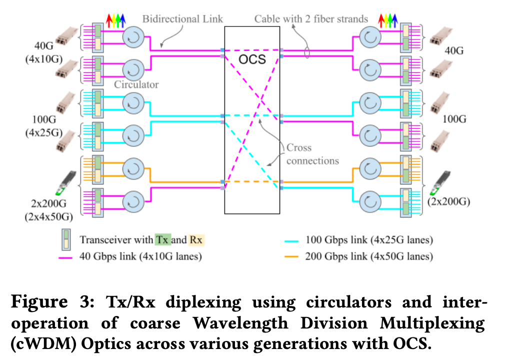

Figure 3 展示了 Jupiter Evolving 能够落地的“物理层黑科技”。如果说 Figure 1 和 Figure 2 展示的是架构层面的宏伟蓝图，那么 Figure 3 就是在解释 Google 如何省钱以及如何让不同年代的硬件真正连通的。

这张图主要展示了两个关键的硬件创新技术：光环形器（Circulators）多代际兼容的光模块（CWDM Optics）。

具体来说，Figure 3 包含了以下两个核心信息：

**1。 “省钱大法”：用光环形器让端口减半（Optical Circulators）**
在传统网络中，连接通常是“收发分离”的（两根光纤，一根发 Tx，一根收 Rx），这需要占用交换机上的两个端口。
- 图中的圆圈图标： 图中画了一些带有旋转箭头的圆圈，这就是光环形器（Circulators）,。
- 它的作用： 它把发送（Tx）和接收（Rx）的光信号合并到单根光纤中进行双向传输（Bidirectional Link）。
- 为什么要这么做？ OCS（光路交换机）的端口是非常昂贵的资源。通过使用环形器，Google 将连接所需的 OCS 端口数量和光纤数量直接砍了一半（Halving the needed OCS ports）。这使得大规模部署 OCS 在经济上变得可行。

**2. “万能插座”：多代际硬件的兼容性（Multi-generational Interoperability）**
之前的 Jupiter Rising 痛点是新旧设备很难混用。Figure 3 展示了如何解决这个问题。
- 图的两侧： 左边和右边列出了不同速率的光模块：
  - 40G (4x10G)
  - 100G (4x25G)
  - 200G (2x200G/4x50G) 等。
- 统一的“语言”： 尽管速率不同，但图示表明它们都使用了统一的 CWDM4（粗波分复用）波长标准。
- 结果： 这意味着，只要光波长对得上，OCS 作为一个纯物理的反射镜，根本不在乎你传输的是 40G 还是 100G 的信号。这使得 Google 可以在同一个网络中随意混插不同年代的设备（如图中所示，不同速率的模块都连接到了中间同一个 OCS 盒子上），实现了真正的增量升级,。

### 复习 Spine, Agg, Rack等概念

没问题，我们回到《Jupiter Rising》的基础设定。要理解 Google 的网络架构演进，必须先搞清楚这个经典的三层架构（Clos 拓扑）。你可以把它想象成一个**“城市交通系统”**。

以下是从最底层（服务器）到最顶层（Spine）的层级讲解：

**1. 最底层：机架（Machine Racks）与 ToR**

这是数据中心的物理单元，也是数据的“家”。

*   机架（Machine Racks）： 一个标准的铁柜子，里面插满了服务器（Servers）。这是计算发生的地方。
*   ToR（Top of Rack Switch，置顶交换机）：
    *   每个机架顶端都有一台交换机，叫 ToR。
    *   作用： 机架里的所有服务器都用网线插到这台 ToR 上。它是服务器通向外部世界的**“第一道大门”**（或者说是家门口的小路）。
    *   在 *Jupiter Rising* 时代，ToR 负责把服务器的流量收集起来，往上传输。

**2. 中间层：聚合块（Aggregation Block，简称 Agg Block）**

*   定义： 这是一个巨大的逻辑单元，由多台高性能交换机组成。
*   连接关系： 很多个机架（ToR）连接到同一个聚合块上。例如，在早期设计中，一个聚合块可能连接几十甚至上百个机架。
*   作用：
    *   汇聚流量： 它把下面所有机架的流量收集起来。
    *   区内通信： 如果机架 A 和机架 B 都在同一个聚合块下面，它们通信只需要经过这个块内部，不需要去最顶层。
    *   向上传输： 如果要联系其他区的机架，它就把流量继续往上发，发给 Spine,。

**3. 最顶层：Spine Block（脊交换机块）**

*   定义： 这是整个网络的最核心层（Backbone）。在 *Jupiter Rising* 时代，它是由大量的电子交换机组成的。
*   连接关系： 所有的聚合块（Agg Block都必须连接到Spine Block。
*   作用：
    *   连通全网：Spine 不直接连服务器，它只连聚合块。它的唯一任务就是让“聚合块 A”能跟“聚合块 B”说话。
    *   带宽保障：为了保证全网不堵车，Spine 层必须非常庞大，提供足够的带宽（Bisection Bandwidth）。
   


**总结：数据包的旅程（在 Jupiter Rising 时代）**

假设**机架 A**（在聚合块 1）的一台服务器，要发数据给**机架 B**（在聚合块 2）：

1.  上坡：数据从服务器 -> ToR -> 聚合块 1。
2.  骨干传输：聚合块 1 -> Spine（脊交换机）** -> 聚合块 2。
3.  下坡： 聚合块 2 -> ToR -> 目标服务器。

这就是经典的 Clos 架构（Spine-Leaf 架构的变体）。

**为什么 *Jupiter Evolving* 要“干掉” Spine？**

结合我们刚才复习的概念，你就能明白 *Jupiter Evolving* 的痛点了：

在 *Jupiter Rising* 里，Spine 是电子交换机，也是网络的中心枢纽。
*   如果你想把下面的聚合块升级成最新的 100G 速度，但顶上的 Spine 还是几年前买的 40G 交换机。
*   那么，新的聚合块必须降速到 40G 才能连上 Spine，因为 Spine 是硬瓶颈,。

所以，*Jupiter Evolving* 用 OCS（光路交换机） 替换了 Spine（电子交换机）。
现在的逻辑变成了：聚合块 1 发出的光，照到 OCS 镜子上，直接反射给 聚合块。中间那个“在这里中转并检查数据包”的电子 Spine 没了，变成了一个纯物理的反射层。


### THE DIRECT-CONNECT JUPITER

如果说第二章是“战略思想”（我们要干掉 Spine，用 OCS 做直连），那么第三章就是“战术执行”（具体的物理层怎么连，逻辑层怎么画图，以及算法怎么把逻辑映射到物理上）。

这一章主要涵盖了以下三个核心内容：

**1. 物理层构建：DCNI 是怎么部署的？**

这一节详细描述了 DCNI（数据中心互连层） 的物理构成。
*   物理部署： DCNI 由一排排专用的机架组成，里面装满了 OCS 设备。最大规模是 32 个机架，每个机架最多 8 台 OCS。
*   扇出连接（Fan-out）： 所有的聚合块（Aggregation Block）并不只连某一台 OCS，而是把自己的连线均匀地分散连接到所有的 OCS 上。这样做的好处是，任何一台 OCS 或者一个机架坏了，只会损失全网一小部分带宽（比如 1/32），而不会导致某个聚合块彻底断网。

**2. 逻辑层设计：起步是“均匀网状”（Uniform Mesh）**

有了物理连接后，软件怎么定义谁连谁？
*   初始策略： 在没有特殊需求时，Google 采用“均匀网状拓扑”（Uniform Mesh）。也就是让每一个聚合块和所有其他聚合块之间的连接数是相等的（Equal number of direct logical links）。
*   目的： 这种设计类似于 *Jupiter Rising* 的 Clos 架构效果，保证了任意两点之间都有带宽，适合处理不可预测的流量。如果直连路径满了，还可以通过中间块跳一跳（1-hop indirect path）。

**3. 核心算法：图的因子分解（Graph Factorization）**

这是这一章最技术性的部分，解决了一个数学难题：**如何把宏观的“逻辑拓扑图”映射到微观的“物理 OCS 端口配置”上？**

*   问题： 假设 SDN 控制器决定：“Block A 需要 50 条线连到 Block B”。但是物理上，这些线分散在几十台不同的 OCS 上。控制器必须告诉每一台 OCS 的具体镜子该怎么转。
*   解决方案： 论文介绍了一种**“多级因子分解”**方法。
    *   故障域切分： 把端口分为 4 个故障域（Failure Domains），每个包含 25% 的端口。
    *   映射算法： 使用整数规划（Integer Programming）将块级别的拓扑需求分解到每台 OCS 的具体端口连接上。
    *   最小化改动： 当拓扑需要改变时（比如修路），这个算法会计算出**“最小变动方案”**，只调整必要的 OCS 连接，尽量减少对现有流量的影响。


Jupiter’s new architecture directly connects the aggregation
blocks with each other via the DCNI layer. Fig. 5 shows
incremental deployment, traffic and topology engineering
in action in such a fabric. The initial fabric can be built with
just two blocks and then expanded (Fig. 5- 1 ○, 2 ○). The direct
logical links between blocks comprise three parts: physical
block-to-OCS links from each of the blocks and an OCS cross-
connect (Fig. 3). Thanks to the OCS, the logical links can be
programmatically and dynamically formed (§ 5).

Jupiter 的新架构通过 DCNI 层将聚合模块直接连接起来。图 5 展示了在这种架构中增量部署、流量和拓扑工程的实际应用。初始架构只需两个模块即可构建，然后可以进行扩展（图 5-1 ○、2 ○）。模块之间的直接逻辑链路包含三个部分：每个模块到 OCS 的物理链路以及 OCS 交叉连接（图 3）。得益于 OCS，逻辑链路可以进行编程控制和动态配置（§ 5）。

For homogeneous blocks, we allocate logical links equally
among all pairs of blocks. If demand perfectly matched the
logical topology, all traffic could take the direct path between
source and destination blocks. Practically, the demand is
variable and not perfectly matched to the logical topology.
Jupiter employs traffic engineering (§4.4) with a combination
of direct and 1-hop indirect paths to balance performance
and robustness against traffic uncertainty (Fig. 5 3 ○).

对于同质块，我们将逻辑链路平均分配给所有块对。如果需求与逻辑拓扑结构完美匹配，则所有流量都可以沿着源块和目标块之间的直接路径传输。但实际上，需求是可变的，并且与逻辑拓扑结构并不完美匹配。Jupiter 采用流量工程技术（§4.4），结合使用直接路径和单跳间接路径，以平衡性能和抵御流量不确定性的鲁棒性（图 5 3 ○）。

We use topology engineering (§4.5) to further better match
the topology to demand. In Fig. 5 4 ○, with lower demand
to/from blocks A/B/C to block D, topology engineering allo-
cates more direct links among blocks A, B, C as compared
to links to block D. We also adjust the topology based on
non-uniform traffic demand (Fig. 5 5 ○), and link speeds of
heterogeneous blocks (Fig. 5 6 ○).

我们利用拓扑工程技术（§4.5）进一步优化拓扑结构，使其更好地匹配需求。如图 5 4 所示，由于块 A/B/C 与块 D 之间的需求较低，拓扑工程技术会在块 A、B、C 之间分配更多直接链路，而不是分配更多链路连接到块 D。我们还会根据非均匀流量需求（图 5 5）和异构块的链路速度（图 5 6）调整拓扑结构。


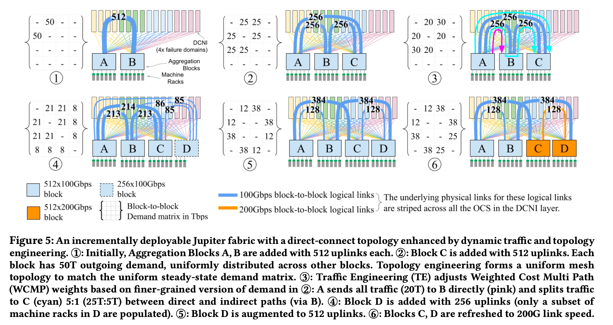

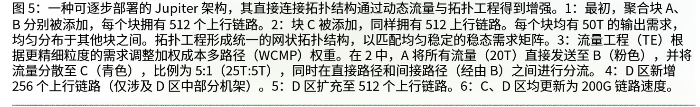

#### 3.1 Datacenter Interconnection Layer

OCSes for the DCNI layer are deployed in dedicated racks.
The number of racks vary, but set on day 1 of deployment
based on the maximum projected fabric capacity. The maxi-
mum size is 32 racks, with up to 8 OCS devices per rack. A
fabric can start with one OCS per rack (1/8 populated), and
later expand the DCNI capacity by doubling OCS devices in
each rack. These expansions require manual fiber moves but
our fiber design layout constrains such moves to stay within
a rack, reducing the disruption and human effort.

DCNI层的OCS部署在专用机架中。機架數量各不相同，但根據最大預計面料容量在部署的第一天設定。最大尺寸为32个机架，每个机架最多可放置8个OCS设备。结构可以从每个机架一个OCS（填充1/8）开始，然后通过将每个机架中的OCS设备翻倍来扩展DCNI容量。这些扩展需要手动移动光纤，但我们的光纤设计布局限制了此类移动保持在机架内，从而减少了干扰和人为工作量。


We fan out the links of each superblock equally to all OCS.
This allows us to create arbitrary logical topologies [46].
Due to the use of circulators, each block needs to have even
number of ports attached to each OCS. These constraints ul-
timately guide the connectivity, as well as trigger expansions
of the DCNI layer as the size of the fabric grows. This design
also enables physical diversity such that a OCS rack failure
impacts each Jupiter block uniformly. For example, failure
of a rack in a 32 OCS rack deployment uniformly reduces
capacity by 1/32, irrespective of the overall size of the fabric.

我们将每个超级块的链接平等地扇向所有OCS。这使我们能够创建任意的逻辑拓扑[46]。由于使用循环器，每个块都需要连接到每个OCS的偶数端口。这些限制最终指导了连接性，并随着织物尺寸的增长触发了DCNI层的膨胀。这种设计还实现了物理多样性，使OCS机架故障均匀地撞击每个木星块。例如，32 OCS 机架部署中的机架故障，无论结构的总体尺寸如何，容量均降低 1/32。

### 读懂图5

图5很重要了，图5其实就是把3.1 3.2 4 都串起来，很重要的一幅图。


首先：

#### 第一个图

> [!important]
> 在1中，A→B = 50 Tbps，B→A = 50 Tbps，表示需求 = 能力。\
> 记住：512 link -> 50Tbps (大约)

**论文想表达什么？**

在最简单情况下，direct-connect 就是“block 之间一根粗管子”
没有多跳、没有 spine、没有 ECMP 复杂性。


另外：
- OCS 被逻辑上分成 4 个 failure domains
- 用 4 种颜色表示（你看到的黄/绿/蓝/粉）
- 每个 block 的 512 uplinks 被均匀分到这 4 组

**每个颜色 ≈ 128 条 link ≈ 25% 容量**

关键一句话（论文原意）

**任何一个 failure domain 挂掉，block 间仍然保留 ≈75% capacity**

**论文想表达什么？**

Direct-connect 不是“一根粗线”，而是“4 根等价的、可独立失效的粗线”

这为后面的 factorization / min-delta / live rewire 全部打基础。

#### 第二个图

- 新增 block C
- 现在是 A / B / C 三个 block
- 需求均匀：任意两块之间都是 25 Tbps

没有拉新光纤，只是改 OCS cross-connect

**论文要点：**

扩容一个新 block，只需要“重新接线逻辑”，而不是物理施工

**这就是他们反复强调：**

“can be done in minutes, better than patch panels”

#### 第三个图

关键变化：需求不再 uniform

- A↔C = 30 Tbps（最大）
- A↔B = 20
- B↔C = 20

但现在的 物理拓扑还是均分的：A→C 只有 256 条 × 100G = 25.6 Tbps

👉 A↔C 不够用

**Traffic Engineering 登场（这一步非常关键）**

右图那几条彩色弯线是啥？
- 表示 2-hop routing
- 示例：

👉 5 Tbps 的 A→C 流量走 A→B→C

为什么合理？
	•	A→B 有富余（20 < 25.6）
	•	B→C 也有富余
	•	多走一跳，但不用改拓扑

**论文想说什么？**

不是所有 mismatch 都靠重连 OCS，TE 是短期 / 小幅 / 快速调节手段

#### 第四个图

新问题：block D 只有一半 uplinks

```
   A  B  C  D
A  - 21 21  8
B 21  - 21  8
C 21 21  -  8
D  8  8  8  -
```

- D 的总出入口能力只有别人一半
- 所以 D↔X 只能给 8 Tbps

> 我能不能这样理解，因为ABC都是full的，所以D的uplink要均分给ABC，256/3 大概就是80多，所以，D和ABC连都是80多。
然后A连BCD，就是2:2:1对吗，所以就是210多：210多：80多？

**论文想表达什么？**

拓扑工程（ToE）可以自然支持“非对称 block”
不要求所有 block 同速、同规模、同代际


#### 第五个图

**异构速率**

场景
- C、D 升级到 200G
- A、B 仍然是 100G

OCS 配置
- C↔D：用 200G links
- C/D ↔ A/B：仍然 100G

左边矩阵
- C/D 内部需求高
- 对 A/B 较低

👉 OCS 允许“不同 block 对之间，链路速率不同”

最关键对比（论文原话隐含）

如果是 预部署 spine：
👉 C、D 仍然被“卡死在 100G”

论文想表达的终极观点

Direct-connect + OCS = 真正支持“演化”的数据中心网络
- block 可增
- 带宽可变
- 需求可变
- 不被历史设计锁死


#### 读懂图6画和图7

二、Figure 6：不是“新图”，而是 图5背后的算法视图

这是你现在必须理解的一张图，否则 §4 会显得很“玄学”。

Figure 6 在回答一个问题：

“图5里的那些 block-level 连线，
到底是怎么映射到 ‘4 个 failure domains × 多台 OCS’ 上的？”

换句话说：

- 图5 画的是 宏观拓扑
- 图6 画的是 端口级 / 故障域级的分解（factorization）

**Figure 6 的核心思想（非常关键）**

他们做的是 multi-level factorization

你在图里会看到类似：
1. 原始拓扑 G
2. 被拆成 G₁、G₂、G₃、G₄（4 个子图）

👉 每个子图：
1. 覆盖 25% 的 uplinks
2. 对应 一个 failure domain
3. 结构“尽量相同”

这就是论文里那句话：

“Each failure domain sees a roughly scaled-down version of the full topology.”

**为什么一定要“结构相似”？**

因为他们的 设计目标不是“活着就行”，而是：

❌ 不是：某些 block 对在 failure 时被打残
✅ 而是：所有 block 对“等比例退化”

这正是 Figure 5(2) 的 four-color design 在算法层面的落地。

**Figure 6 还在偷偷讲一件很重要的事**

Topology reconfiguration 要“最小改动”（min-delta）

你会看到图里：
1. 蓝色边：保留
2. 红色边：新增 / 删除

👉 这为 §4.3 的 live rewiring 做铺垫：

“我们不是每次重算就全断重连，而是改最少的链路。”

用一句话总结 Figure 6

**Figure 6 说明：**
**图5 那样的 block-level 拓扑，是通过对端口和 failure domains 的多层分解实现的，而且可以在重构时做到“最小扰动”。**

三、Figure 7：当 Figure 5「不够用了」时，系统怎么兜底

Figure 7 是 §4 的灵魂图。

Figure 7 在回答什么问题？

“如果拓扑（ToE）暂时没跟上需求变化，
网络是不是就炸了？”

答案是：不会，因为有 Traffic Engineering（TE）

Figure 7 的核心点（非常重要）

1️⃣ 他们明确限制：最多 1 次中转（2-hop）

图里你会看到：
1. 直连路径（1-hop）
2. 少量通过中间 block 的路径（2-hop）

👉 他们明确不搞 3-hop、4-hop

这是 Google 生产网络的一个极强约束。

2️⃣ 为什么只允许 2-hop？

Figure 7 + §4.2 其实在给你一个“工程答案”：
- 拓扑已经“尽量 match demand”
- 剩下的 mismatch：
- 短期
- 小比例
- 局部热点

用 2-hop 来“抹平”，代价最低
- latency 增加可控
- ECMP / congestion 可控
- 控制面复杂度不上天

**用一句话总结 Figure 7**

Figure 7 展示了在 direct-connect 拓扑下，少量、受控的 2-hop Traffic Engineering 足以应对需求波动，而无需复杂多跳或预部署 spine。

四、把所有图放在一条主线上（这是你最终该记住的）

我帮你把 Figure 5 / 6 / 7 压成一条“作者脑回路”：

1️⃣ Figure 5：
我们可以用 OCS 构造一个随需求演化的 direct-connect 拓扑

2️⃣ Figure 6：
这个拓扑在端口级、故障域级是可实现、可重构、可控的

3️⃣ Figure 7：
当拓扑暂时不完美时，少量 2-hop TE 足以兜底

👉 这三张图 合起来就是 Jupiter Evolving 的核心贡献


