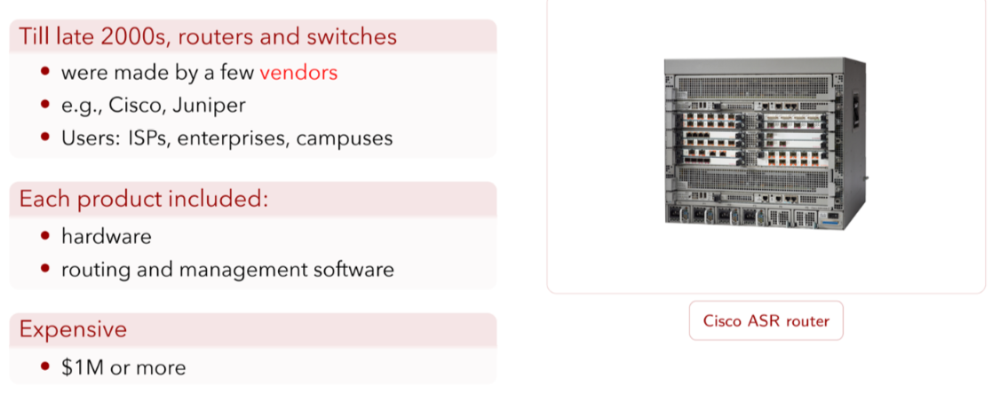
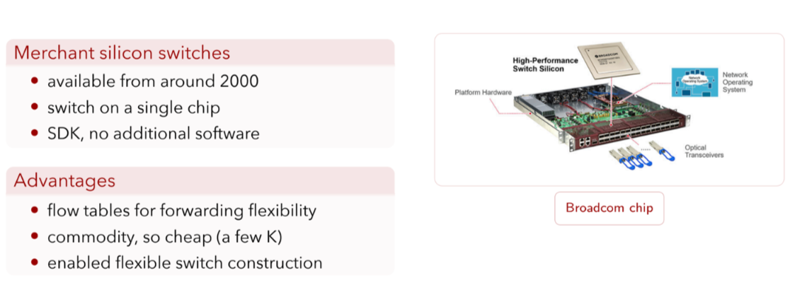
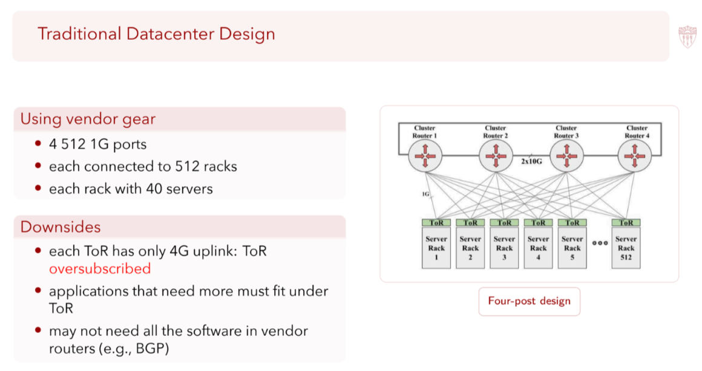

# Jupiter Rising

[TOC]

## Background

|  |  |
| ------------------------------------------------------------ | ------------------------------------------------------------ |

### Traditional Switches and Routers

网络设备主要由少数厂商提供（如 [Cisco](chatgpt://generic-entity?number=0)、[Juniper](chatgpt://generic-entity?number=1)）

典型用户：ISPs, enterprises, campuses

产品形态：

- 专有硬件
- 专有路由与管理软件（hardware + software tightly coupled）

特点：

- Vendor lock-in 严重
- 难以定制与快速演进

成本：

- 高端设备价格可达 $1M 以上

**论文原文（背景问题）**

“Traditional routers tightly integrate hardware and software, making them difficult to customize or evolve.” *(Jupiter Rising, Section 2: Background)*

传统路由器将硬件与软件紧密耦合在一起，使其难以进行定制或演进。

### Merchant Silicon Switches

出现时间：约 2000 年左右

特征：

- 单芯片交换（switch on a single chip）
- 提供 SDK
- 不强制绑定完整网络操作系统

优势：

- 支持基于 flow table 的灵活转发
- 商品化（commodity），成本低（几千美元级）
- 支持自定义交换机与网络架构

**论文原文（硬件选择动机）**

“Rather than relying on expensive, vertically integrated routers, we build our network using commodity merchant silicon switches.” *(Jupiter Rising, Section 2)*

与依赖昂贵的垂直整合路由器不同，我们使用商品化的商用交换芯片来构建数据中心网络。

> Merchant silicon 是 Google 能够构建 Clos 拓扑、并在其之上实现集中式控制平面的物理基础。

## Preparation

