# Supplementary-Topology

- [Supplementary-Topology](#supplementary-topology)
  - [Alibaba HPN](#alibaba-hpn)
    - [Page3](#page3)
    - [Page4](#page4)
    - [Page5-6](#page5-6)
    - [Page7 Hosts](#page7-hosts)
    - [Page8 Segments](#page8-segments)
      - [如果“没有 segment”，会发生什么？](#如果没有-segment会发生什么)
      - [Segment 的核心目的（先给结论）](#segment-的核心目的先给结论)
    - [Page9 Rail-Optimized ToR Design](#page9-rail-optimized-tor-design)
    - [Page10 Pods](#page10-pods)
    - [Page11 Core Layer](#page11-core-layer)
    - [Page12 Reducing Hash Polarization](#page12-reducing-hash-polarization)
  - [NegotiaToR](#negotiator)
    - [Page14](#page14)
    - [Page15](#page15)
    - [Page16](#page16)
    - [Page17 Overview](#page17-overview)
    - [Page18 Two-phase Scheduling; Page19-20](#page18-two-phase-scheduling-page19-20)

## Alibaba HPN

### Page3

首先就是：

“Large language model training workloads exhibit communication patterns that are significantly different from traditional data center applications.”

大语言模型训练的通信模式与传统数据中心应用显著不同。

**LLM training：**

- few large flows
- periodic

**后果：**

- ECMP hash polarization
- single ToR failure 可能会导致 training failure

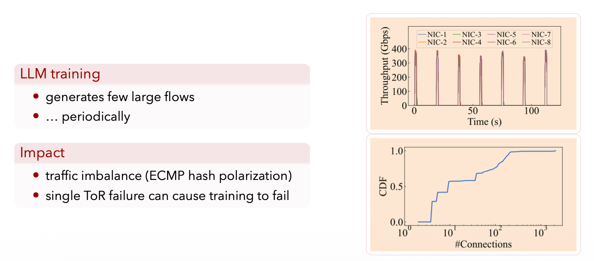

**图什么意思：**

- 吞吐量图：训练 step 同步 → 流量周期性 spike
- CDF 图：连接数很少，但承载了大部分流量

> **ECMP 哈希极化** 是指在数据中心网络中，流量在多条等价路径（Equal-Cost Multi-Path）上分配不均匀的现象，导致某些链路极其拥堵，而其他链路却很空闲 。

造成的后果

- **流量不均（Traffic Imbalance）：** 就像原本有 10 条车道，但指挥系统（哈希算法）错误地把所有卡车都挤进了第 1 条车道，导致第 1 条堵死，第 2-10 条却空着 。
- **训练停滞：** LLM 训练是一个同步过程（Synchronous Process），所有 GPU 必须等最慢的那个跑完才能进行下一步。一旦某条链路发生哈希极化导致拥塞，整个集群的训练效率都会被拖垮，甚至导致训练失败 。

### Page4

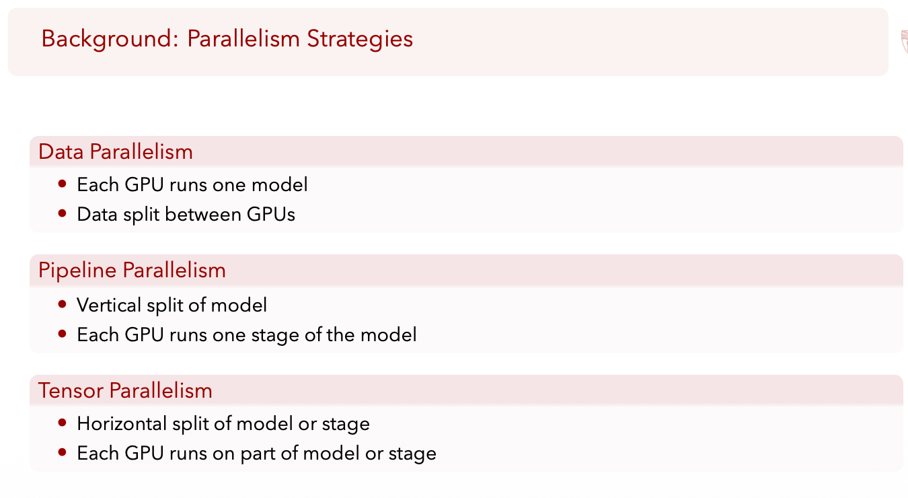

反正意思是，在LLM训练中，存在大量的并行。大量的GPU之间的通信。这导致了：网络已经成为了训练瓶颈的一部分，所以需要设计一个高性能网络，去适应LLM的训练。

### Page5-6

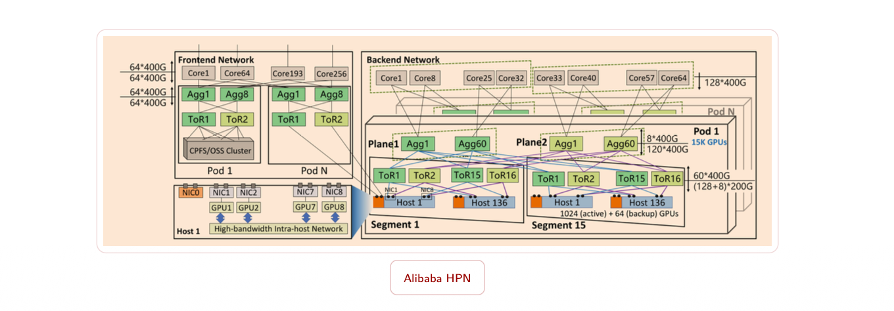

- Front-end network fro storage, inference
- Back-end network for training

### Page7 Hosts

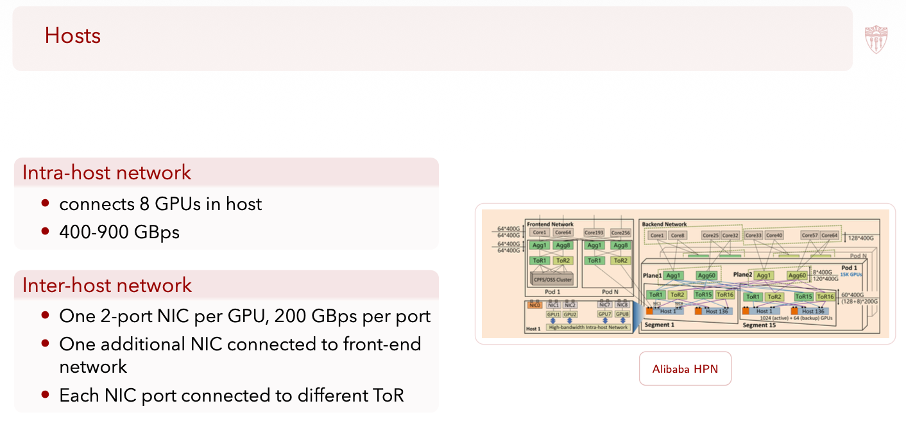

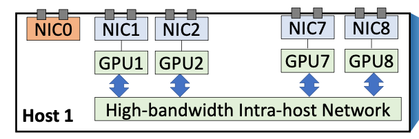

这样设计的本质目的：**把“GPU 训练通信的瓶颈/故障域”尽量从网络里拿掉，靠 host 侧的多口 NIC + 分散上联，把带宽、负载均衡、可靠性提前在源头解决。**

NIC是网卡。

- 机内网络：连 8 个 GPU，带宽 400–900 GBps
- 机间网络：每个 GPU 一个 2-port NIC，每个 port 200 GBps
- 还有一个额外 NIC 连 front-end 网络
- 每个 NIC 的两个 port 分别连不同 ToR

***

**目的 1：匹配 LLM 训练的真实通信形态（大流 + 同步）**

LLM 训练（尤其 all-reduce / all-to-all 类）特点是：

- **同步**：一轮迭代大家同时开始通信
- **大流**：不是很多小流，而是少数巨流把链路打满（你前面 Page 3 已经讲了“few large flows”）

所以 host 的目标不是“能连上网”就行，而是：

- 每台机器要能稳定、持续输出巨量带宽到网络里
- 还要在 burst 同步时不被某一条上联卡死

‼️这就引出：每个 GPU 配 NIC，而且还给 2 个 port，总带宽直接在 host 侧做足。

**目的 2：把“负载均衡”从 ECMP 的随机性里解放出来**

你这门课讲过 ECMP hash polarization：少量大流时，hash 很容易把流压到同一条等价路径，造成极端不均衡。

这里的 host 设计在干一件事：

- ‼️**把同一台 host 的外发流量，天然分散到不同 ToR（不同上联扇出）**
- 这比“希望交换机 ECMP hash 均匀”靠谱得多，因为：
  - ‼️你不是把所有流都丢给同一个 ToR 再让它 ECMP
  - ‼️而是**一开始就把源头出口拆开**（两个 port → 两个 ToR）

所以“每个 NIC port 连不同 ToR”的目的就是：

> **降低 hash 极化的爆炸半径，把极化从“全 host 的流”压缩到“单个 port 的流”。** 

**目的 3：可靠性/故障域拆分（单 ToR 挂了不至于整机掉线）**

LLM 训练对故障很敏感（Page 3：single ToR failure can cause training to fail）。

Host 这页的设计直接在结构上做冗余：

- 两个 port 连两个 ToR
- ‼️**一个 ToR 失效时，至少还有另一条物理出口还活着**
- 后面 Page 9 的 rail-optimized ToR 会把“这条活路”用更系统的方式讲出来，但 Page 7 已经在 host 侧把硬件基础铺好了

一句话：

> **把“训练挂掉”的条件，从“任何一个 ToR 故障”提升为“多个上联/ToR 同时故障”。**

**目的 4：训练网络与前端网络隔离（不互相污染）**

这页还提了 “one additional NIC connected to front-end network”。

目的很直接：

- front-end（存储/推理/控制）流量与 back-end（训练）流量的 QoS/拥塞特征完全不同
- 如果共用同一批 NIC/队列：
  - 训练大流会把前端小流压扁
  - 前端抖动也会影响训练稳定性

所以额外 NIC 是在做：

> **控制面/数据面隔离 + 训练面不被杂流影响。**

### Page8 Segments

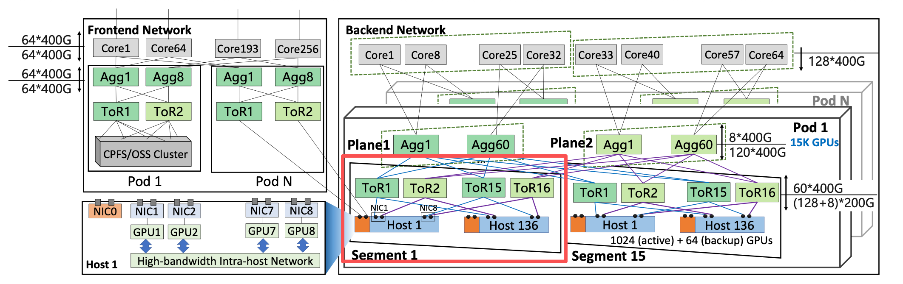

Segment 是什么？

> Segment = 把一大堆 GPU 切成一个“网络上相对独立、好管理、好训练”的大块。

在 Alibaba HPN 里：

- 1 个 segment = 1024 个 GPU
- 训练 job 尽量完全待在一个 segment 里

**为什么 Page 7（Host）之后，必须要有 Page 8（Segment）？**

你先想一个问题：

如果我已经在 host 层把 GPU 出口做得很好了—— 每 GPU 一个 NIC、两个 ToR

> **那还不够吗？**

答案是：完全不够。

原因只有一个，但非常致命：

> LLM 训练不是“一台机器的问题”，是“上千 GPU 同步的问题”。

#### 如果“没有 segment”，会发生什么？

**❌ 问题 1：通信范围太大**

LLM 训练（data / tensor parallel）意味着：

- 每一轮迭代
- GPU 需要和 **很多其他 GPU 同步**

如果是“全网扁平”：

- 同步通信可能跨越 **任意远的机器**
- 网络延迟、拥塞、失败概率全部上升

**❌ 问题 2：训练 job 会互相干扰**

- Job A 在同步
- Job B 在同步
- Job C 在同步

👉 大流互相打架

👉 网络抖动不可控

👉 tail latency 爆炸

👉 训练 step 不稳定

**❌ 问题 3：任何局部故障都会被“放大”**

- 一个 ToR、一个链路、一个 plane 抖一下
- 影响的是 **整个集群里的训练**

LLM 训练 **不能接受这种不确定性**。

#### Segment 的核心目的（先给结论）

Page 8 的 Segment 设计，本质是在做三件事：

- 限制训练通信的“活动范围”

- 把训练 job 隔离在网络上

- 把故障、拥塞的影响“关在笼子里”

在设计上，job尽量不跨segment，但是segment内可以有多个job共存

另外：**Each NIC port connects to a different ToR**

在一个 segment 里，GPU 的出入口已经在结构上被均匀地“撒”在多个 ToR 上。

结果是：

- segment 内部的通信：不会集中压某一个 ToR
- segment 对外看起来：像一个 “已经负载均衡过的大块”

***

**Page 7（Host）**：

👉 解决“单台机器怎么优雅地进网络”

**Page 8（Segment）**：

👉 解决“上千台机器怎么一起优雅地训练”

> [!important]
>
> **Segment 的设计，是为了把大规模 LLM 训练的同步通信，限制在一个规模可控、结构均匀、故障可隔离的网络子域中，从而保证训练稳定性、可预测性和可扩展性。**

### Page9 Rail-Optimized ToR Design

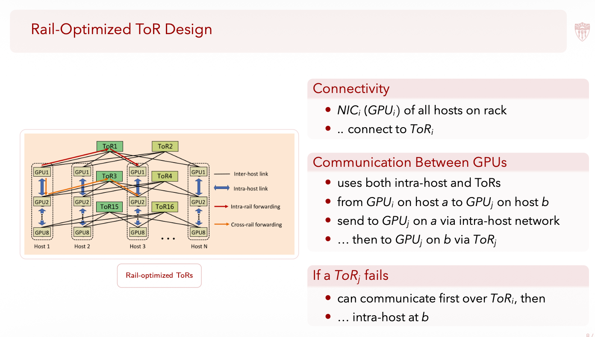

**Rail-Optimized ToR 的目的，是让“任意一个 ToR 挂掉”，训练仍然能继续，只是慢一点，而不是直接死掉。**

假设没有这个设计：

```
GPU a  ──→  ToR X  ──→  网络  ──→  ToR Y  ──→  GPU b
```

如果 ToR Y 挂了，两个 GPU 就会直接失联，训练直接失败了。

**Rail = “按 GPU 编号分开的、平行的网络通道”**

你可以这样理解：

- GPU 0 的“对外世界” → Rail 0 → ToR 0
- GPU 1 的“对外世界” → Rail 1 → ToR 1
- GPU 2 → Rail 2 → ToR 2
- …

也就是说：

**不是所有 GPU 共用一堆 ToR，而是 GPU i 主要通过 ToR i 对外通信。**

反正最终的目的就是，ToR如果挂了，不再是致命单点。

- 挂一个 ToR：
  - 不是训练直接失败
  - 而是绕路，性能下降

### Page10 Pods

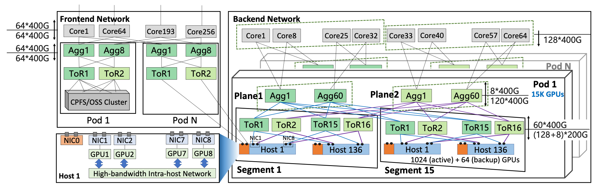

Pod 是什么：

- 一组 15 个 segment
- 总计 15K GPU

目标：

- 所有训练 job 都能塞进一个 pod

连接方式：

- Segment 之间通过 两个 plane 互联
- 每个 NIC port 走不同 plane

***

LLM 训练里：

- 最重的通信（all-reduce / tensor parallel）尽量放在 segment 内

- 跨 segment：
  - 要么很少
  - 要么可以慢一点

👉 所以 pod 是一个：

> **“弱连接多个强连接单元”的结构**

**你现在应该意识到一件事（非常重要）**

Alibaba HPN 的设计哲学是：

> **“能靠结构解决的问题，绝不靠算法；**

> **能靠物理隔离解决的问题，绝不靠调度。”**

- Host：多 NIC、多 port
- Segment：通信范围限制
- Rail：ToR 故障可绕
- Pod：双 plane + job 边界

**每一层都在做同一件事：提前消灭不确定性。**

### Page11 Core Layer

Core Layer 在 Alibaba HPN 里，从来不是训练性能的主角。

Core Layer：

- 连接多个 pod
- 拓扑类似双 plane

特点：

- **高度 oversubscribed**

使用场景：

- 很少有训练 job 超过 pod
- 主要用于 pipeline parallelism（流量很小）

### Page12 Reducing Hash Polarization

既然：

- Core 是 oversubscribed
- 路径少
- ECMP 一旦 hash 极化，直接炸

Deterministic Path：

- 在 pod 内，一旦选定 ToR，路径是确定的

Application-level load balancing：

- 应用跟踪流量
- 设置 hash key

目标：

- 避免 hash polarization

**Alibaba 的选择：把路交给应用**

> 他们做的是：
>
> > **应用知道自己在发什么流、发多大、发多久，**
>
> > **那就由应用来决定“这条流走哪条路”。**
>
> 具体来说：
>
> - 不靠 ECMP 自动 hash
> - 应用：
>   - 监控当前流量
>   - 主动调整 hash key
>   - 把流均匀铺在有限路径上
>
> 👉 **这是“应用协同网络”的典型例子**

## NegotiaToR

- Alibaba HPN 是“结构定死、靠工程兜底”，

- NegotiaToR 是“结构可变、靠调度兜底”。

### Page14

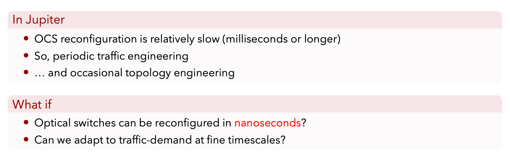

Jupiter 时代的问题：

- 光交换（OCS）重构慢（ms 级）
- 所以只能：
  - 周期性 traffic engineering
  - 偶尔 topology engineering

- 提问：
  - 如果光交换能 **ns 级重构** 呢？

**这一页的核心动机**

NegotiaToR 直接接着 Jupiter 问：

> **如果“换路”几乎是免费的，那网络是不是可以像 CPU 一样频繁调度？**

这正是 Jupiter Evolving 的思想延伸。

### Page15

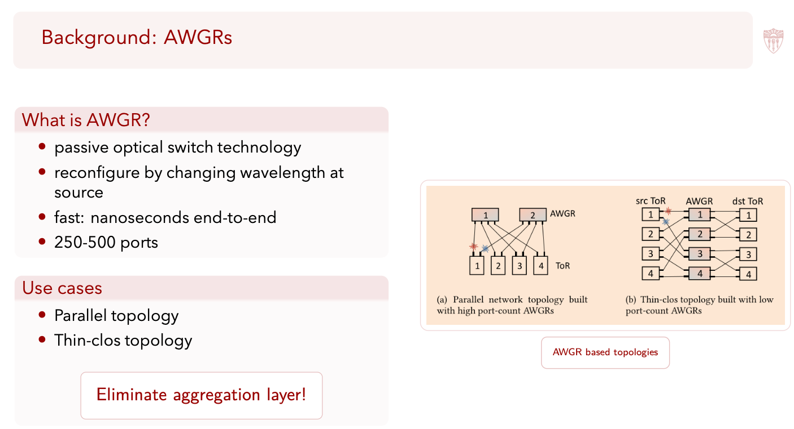

AWGR 是什么：

- 被动光交换
- 通过 **换波长 = 换连接**
- ns 级
- 250–500 ports

支持的拓扑：

- Parallel
- Thin-Clos

**这一页真正重要的点**

AWGR 带来一个**质变**：

> **网络连接不再靠“线插在哪里”，**

> **而是靠“你现在用什么波长”。**

这意味着：

- 拓扑 = 软件可控
- 不需要中间缓冲
- 可以 ToR ↔ ToR 直接连

### Page16

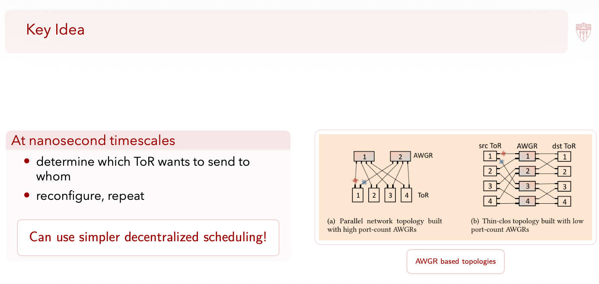

在 ns 时间尺度

- 决定谁要和谁通信
- 重构
- 重复

结论：

- 可以用 **更简单的、去中心化调度**

**这里在“反谁”**

反的是：

- 复杂集中调度
- 全局 traffic matrix
- 预测未来流量

NegotiaToR 的态度是：

> **我不预测，我只看“现在有没有需求”。**

### Page17 Overview

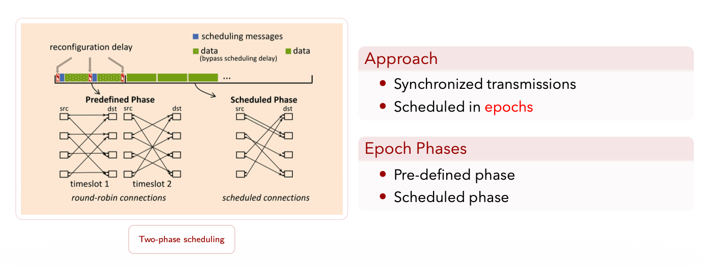

### Page18 Two-phase Scheduling; Page19-20

**Pre-defined phase**

- 网络按 round-robin 全连
- ToR 之间：
  - 交换需求
  - 算调度
- 这阶段是：
  - **控制面**

**Scheduled phase**

- 网络按算好的结果重构
- 直接发数据
- 这是：
  - **数据面**

**这一页的本质**

一句话：

> **NegotiaToR 把“控制”和“数据”硬切成两段时间。**

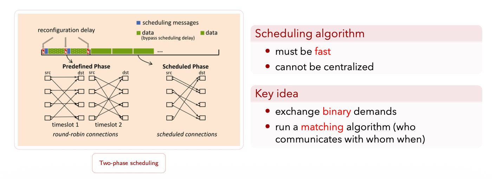

这个算法一定要够快

1. **非常快**
2. **不能集中式**
3. **不能复杂**

行，这里我给你一个**可以直接复制进 note 的总结版**，只保留**P20–P21 的 matching 过程本体**，不废话、不引申。

**NegotiaToR Matching（REQUEST / GRANT / ACCEPT）总结**

**目标**

在 ns 级可重构光网络中，**快速、分布式地**为 ToR–ToR 通信生成一组**无冲突的一跳连接**，不依赖集中控制、不预测流量。

**1. REQUEST（需求声明，ToR → ToR）**

- 每个 ToR 维护按目的 ToR 划分的队列
- 若某个目的 ToR 队列非空，则向该目的 ToR 发送 REQUEST
- REQUEST 是 **binary** 的：只表示“有需求 / 没需求”，不包含流大小或优先级

含义：

ToR 只暴露**当前是否需要通信**，避免复杂状态和过期信息。

**2. GRANT（端口分配，目的 ToR 侧）**

- 一个目的 ToR 可能收到多个源 ToR 的 REQUEST
- 目的 ToR 的每个端口只能接收 **一个** 源 ToR
- 使用 **round-robin** 在请求者中选择，为每个端口发出 GRANT

含义：

在**目的端消除“多对一”冲突**，保证端口不被同时争抢。

**3. ACCEPT（最终选择，源 ToR 侧）**

- 一个源 ToR 的端口可能收到来自不同目的 ToR 的多个 GRANT
- 每个端口只能接受 **一个** GRANT
- 源 ToR 使用 **round-robin** 选择并 ACCEPT 一个 GRANT

含义：

在**源端消除“一对多”冲突**，确保端口只连接一个目的。

**4. 结果**

- ACCEPT 后确定的 ToR–ToR 连接集合：
  - 无端口冲突
  - 无需 buffer
  - 全部是一跳直连
- 各 ToR 根据 ACCEPT 结果设置波长，在 scheduled phase 直接传数据

**5. 设计要点（为什么这样设计）**

- **Binary demand**：简单、快、不易过期
- **No iteration**：避免 RTT 导致调度结果失效
- **Distributed**：无集中调度瓶颈
- **Round-robin**：保证公平，避免饥饿

NegotiaToR Matching 通过 REQUEST–GRANT–ACCEPT 三步，在 ToR 两端分别消除多对一和一对多冲突，用极简的分布式 round-robin 机制，在每个 epoch 内生成一组无冲突的一跳光连接。
